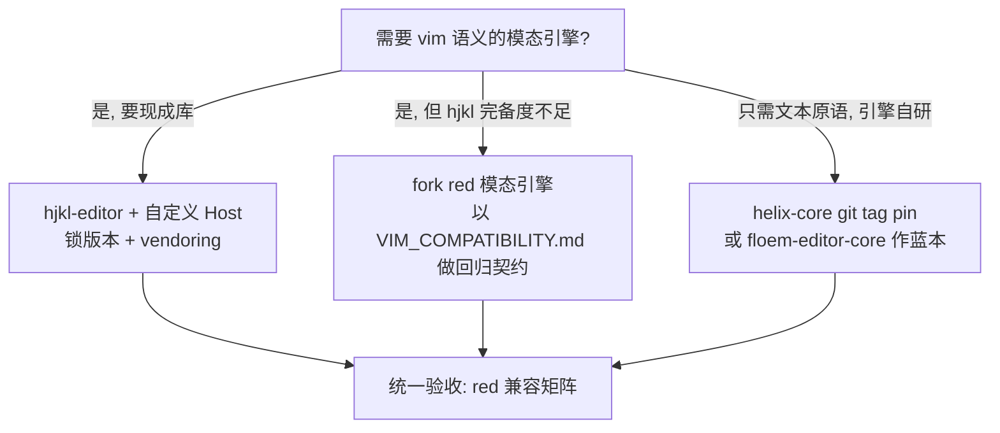
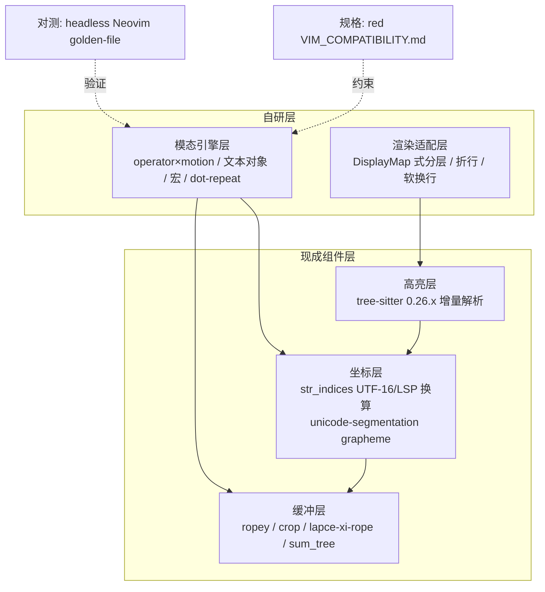
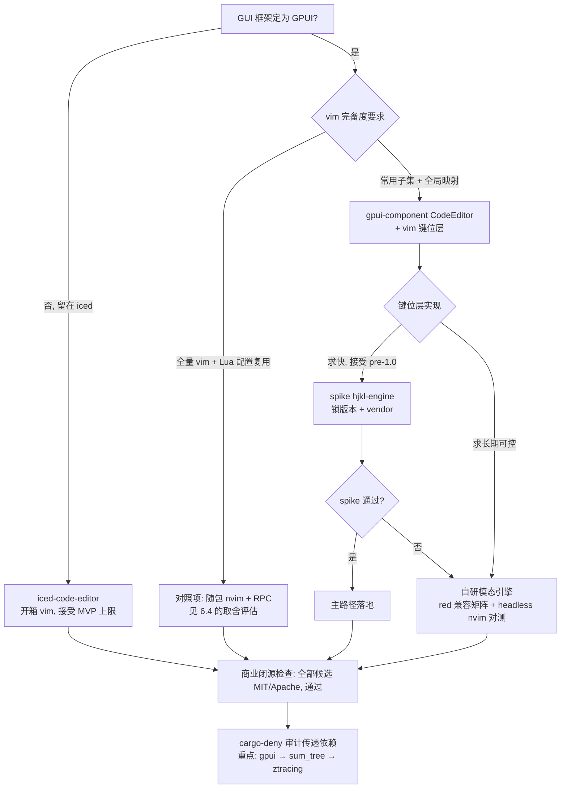

# Rust IDE 编辑器代码级嵌入方案调研报告

**日期**：2026-08-07

**摘要**：本报告面向一个 Rust 实现的 agent-first IDE（跨 Windows/Linux/macOS、商业闭源），调研「编辑器核心代码级嵌入 + vim 模态编辑」的六条技术路线。一手证据否决了 libnvim 静态库嵌入与 zed editor crate 复用两条「正统」路线；最终推荐以 gpui-component CodeEditor 为组件底座、hjkl-engine（spike 不通过则自研模态引擎）实现 vim 键位层，并以 red 兼容矩阵、headless nvim 对测和 vendor/fork/许可证审计构成验收与供应链纪律，「随包分发 nvim + RPC」保留为 vim 完备度升级触发时的对照解。

---

## 1. 背景、需求与评估框架

### 1.1 问题定义与决策意义

本项目是一个以 agent 功能为核心的 IDE（Rust 实现，跨 Windows/Linux/macOS），当前进入 editor 功能开发阶段。编辑器的硬性要求是支持 vim 模态编辑，且最好做到**代码级嵌入**——编辑器核心以库形式链接进 IDE 同一进程，而非依赖外部可执行程序。

这不是一次普通的依赖选型。编辑器核心是 agent IDE 的交互地基：buffer 模型、撤销历史、光标与选区系统、键位分发，会被后续的 LSP 集成、agent 内联编辑、diff 视图等所有上层功能直接依赖。一旦选定，替换成本随代码量增长而指数上升，实际等于锁定多年的架构方向。因此本章先把约束与评估框架讲清楚，再进入候选方案逐项核查。

最初的思路是嵌入 neovim，但该路线基于进程间通信（msgpack-RPC），要求终端用户自行安装 neovim，跨平台分发体验差，与「开箱即用的 IDE 产品」定位冲突，已被排除。helix 编辑体验优秀，但其不发布公开 crate，无法通过 crates.io 常规依赖。若调研后无可行方案，将以自研编辑器作为兜底。

### 1.2 硬性约束清单

下表汇总本次选型的全部硬性约束，任何候选若违反其中一条即出局或降级为备选：

| # | 约束 | 说明 |
|---|------|------|
| C1 | 代码级嵌入 | 编辑器核心以 crate 形式链接进 IDE 进程，不依赖外部进程或需用户预装的软件 |
| C2 | 跨平台 | Windows / Linux / macOS 三平台均可构建与分发 |
| C3 | Rust 生态 | 与 IDE 主工程同语言，可直接调用；C ABI 方案需有可用绑定 |
| C4 | vim 模态能力 | 至少覆盖常用模态编辑子集；目标为全局 vim 映射（不止编辑器内部） |
| C5 | 许可证兼容 | 项目为商业闭源，依赖许可证须允许静态链接进闭源产物 |
| C6 | 供应链可持续 | 上游维护活跃、断更风险可控；断更时具备 vendor/fork 自维护的可行性 |

除硬约束外，还有两个影响权重的背景诉求：其一，IDE 配置曾希望可用 Lua 实现，若某方案能复用 Lua 配置生态则加分；其二，GUI 层倾向迁移到 GPUI，候选方案与 GPUI 的耦合成本直接影响落地工作量。

### 1.3 评估框架

本报告对每条技术路线统一使用以下六个维度评估，第二至五章逐项展开，第六章给出决策矩阵：

1. **可嵌入性**——能否真正以库形式嵌入：API/ABI 稳定性、crate 发布状态、与宿主进程的资源生命周期耦合方式。
2. **vim 功能完备度**——模态编辑子集的覆盖广度与行为保真度，是否有明确的兼容性规格或对测手段。
3. **维护可持续性**——上游组织规模、提交活跃度、版本管理纪律（semver / crates.io 发布频率）、单人项目风险。
4. **许可证**——是否允许商业闭源静态链接，重点排查 copyleft（GPL 系）污染。
5. **分发/构建成本**——依赖树规模、构建时间、交叉编译与打包复杂度、终端用户侧是否需要额外安装。
6. **与 GPUI 路线的契合度**——候选在 GPUI 技术栈下的集成路径、键位系统复用程度、UI 层重写工作量。

### 1.4 调研范围总览

本次调研共覆盖六条技术路线：**libnvim/libvim**（neovim/vim 的库化嵌入）、**zed editor crate**（复用 Zed 编辑器）、**helix workspace**（git 依赖 helix-core 等内部 crate）、**hjkl 引擎**（vim 模态状态机库）、**floem-editor-core**（Lapce 系编辑器核心），以及 **GUI widget 级方案**（GPUI/iced 生态的编辑器组件）；若以上均不满足，则以**自研编辑器**兜底。各路线结论与最终选型建议详见第六章。

---

## 2. 被否决的路线

在确定推荐方案之前，先把两条看似诱人、实则已被证据否决的路线讲清楚：把 neovim/vim 核心以 C 静态库形式链接进 Rust 二进制（libnvim / libvim），以及以 git 依赖直接复用 zed 的 `editor` / `vim` crate。两者都经不起一手证据的检验。

### 2.1 libnvim 静态库嵌入：官方不支持 + 唯一生产用户已放弃

**产物存在，但没有任何「库」的配套。** neovim 的 CMake 里确实有 `add_library(libnvim STATIC EXCLUDE_FROM_ALL)`，`make libnvim` 能产出 `libnvim.a`——但它是 `EXCLUDE_FROM_ALL`（默认构建不含它），没有任何 `install()` 规则，没有共享库开关，也不导出公共头文件[^1^]。官方文档对嵌入的全部说明只有一句话：「Applications can also embed libnvim to work with the C API directly.」[^2^] 核心维护者 bfredl 的表态更直白：「原则上可以用，只是没有公共/私有头文件之分，任何内部代码改动都可能 break 你的 libnvim 使用」[^3^]。追踪「正式支持 C API」诉求的 issue #21693 挂了三年半仍 open，其待办清单（提供 `*.h` 头文件、声明 SONAME、文档化 ABI 契约、文档化正确用法）一项都没完成[^4^]。

**即便链上，收益也有限。** #21693 指出，进程内嵌入 UI 的现行做法是「链接 libnvim，然后对它讲 msgpack」——与进程外 UI 完全相同的协议和事件循环[^4^]。代码级嵌入省掉的只是进程边界，不是序列化开销；而 neovim 的事件循环内核与「同步函数式核心」存在架构性矛盾。

**唯一生产用户已撤退。** VimR 曾长期是 libnvim 的唯一知名用户（其 NvimServer 曾静态链接 libnvim，且即便那时也是独立 helper 进程 + msgpack）[^5^]。但早在 neovim v0.10.0 时代（约 2024 年，GH-1015，非近期变更），VimR 就放弃了这条路线：当前 master 的构建脚本直接把官方预编译 `nvim` 二进制原样拷贝改名为 NvimServer，连同 runtime 打进 app bundle，以子进程 + msgpack-RPC 驱动[^6^]。至此 libnvim 在生产环境零用户。

**Onivim 2 的 spike 失败与 libvim 的死胡同。** Onivim 2 最初计划原型化 libnvim 方案，但 bryphe 做了 2 天 timebox 调研后放弃：其 OCaml/esy 的 Cygwin+MinGW Windows 工具链下预估要 3–4 周才能跑通构建，且 neovim 事件循环核心「需要被短路或移除」才能提供同步 API。于是他转去 fork Vim 8 做了 libvim[^7^]。libvim 把 Vim 建模为 `(editor state, input) => (new editor state)` 的纯函数，只负责 buffer/按键/VimL/mapping，明确不做 UI、语法高亮、补全、终端、IME——但它最后 push 停留在 2021-09-23，已实质停更约 5 年，冻结在无 LSP、无 Lua、无 tree-sitter 的 Vim 8.x 状态[^8^]。

**Rust 侧从零起步，许可与分发还有暗坑。** crates.io 上不存在任何 libnvim/libvim 的 binding crate，选这条路要自己写 bindgen + build.rs 驱动 CMake[^9^]。依赖链约 10 个 C 库（libuv、luajit、libutf8proc、tree-sitter 及 6 个 parser、unibilium 等），构建含 Lua 代码生成步骤[^10^]；其中 unibilium 是唯一的 LGPLv3 依赖，静态链接进闭源产品前必须用 `-DENABLE_UNIBILIUM=0`（配合 `-DFEAT_TUI=OFF`）排除[^11^]。此外即便库级嵌入，`$VIMRUNTIME`（syntax、ftplugin、Lua stdlib、tree-sitter queries）仍必须随应用分发，「单二进制」并不成立[^12^]。

### 2.2 zed editor crate：技术耦合 + GPL 双重否决

**技术上抽不出来。** zed 是一个约 250 个 crate 的单体 workspace，workspace 级 `publish = false`，全部内部 crate 以 path 依赖互连，未发布到 crates.io；根清单还带一组 `[patch.crates-io]` fork 补丁，外部以 git 依赖引用时不会生效[^13^]。一手 Cargo.toml 显示，`editor` 直接依赖约 40 个 zed 内部 crate——不仅有 `multi_buffer`/`language`/`text` 等合理下层，还包括 `workspace`（应用壳，构成反向依赖）、`client`/`rpc`（协作网络层）、`db`（SQLite）、`telemetry`（遥测）[^14^]。引入 `editor` ≈ 把半个 zed 应用拖进依赖图。`vim` crate 同样不是独立的模态编辑引擎，而是依赖 `editor`/`workspace`/`picker`/`search`/`command_palette` 的胶水层，其 operator/motion 直接操作 zed `Editor` 的具体类型——官方博客明确「Zed 的全部 Vim 模式都在单个 `vim` crate 里」，但它假定底下是 zed 的 Editor[^15^]。

**法律上一票否决。** `editor`/`vim`/`text`/`rope`/`multi_buffer`/`language` 全部标注 `GPL-3.0-or-later`[^16^]。Rust 静态链接、单二进制的编译模型使 GPL 传染性没有灰色地带：嵌入这些 crate 后，整个二进制须按 GPL 提供源码，商业闭源 IDE 直接出局[^17^]。这是官方刻意为之——2024 年开源公告写明「editor 用 copyleft 许可以确保改进回馈社区，可自由商用的部分只有 Apache-2.0 的 GPUI」[^18^]。

**生态零先例。** 公开生态中没有任何第三方成功嵌入 zed 的 `editor` crate：前 zed 团队成员 Nate Butler 做「GPUI 的 Monaco」（gpui-editor）选择从 GapBuffer 起步从零写[^19^]；GPUI 生态最成熟的商用组件库 longbridge/gpui-component（支撑 Longbridge Pro 终端）同样自研编辑器，文本存储用社区 crate `ropey` 而非 zed 的 GPL rope[^20^]。

**附注：GPUI 本身可用，但需 license 审计。** GPUI 是 Apache-2.0，2025-10 已由官方发布到 crates.io（0.2.x），可用于构建任意许可的桌面应用[^21^]。但已发现 GPL 传递污染：默认 release 构建经由 `gpui → sum_tree → ztracing(GPL)` 链静态链接进 GPL 目标码（issue #55470，2026-05 报告时未确认修复）[^17^]。`sum_tree` 本身是 Apache-2.0 且近乎自足，vendor 后把 `use ztracing::instrument` 换成 `tracing::instrument` 即可净化[^22^]。商业项目即便只用 GPUI，也必须跑 `cargo-deny`/`cargo-about` 审计传递依赖。

### 2.3 小结：两条路线的否决要点

| 维度 | libnvim / libvim 静态库 | zed `editor` / `vim` crate |
|---|---|---|
| 官方态度 | 「C API not officially supported」，#21693 挂 3 年半无进展[^4^] | 刻意 GPL 防商用复用；`publish = false`，从未按库设计[^18^] |
| 耦合/集成成本 | ~10 个 C 依赖 + CMake + 自写 bindgen/build.rs[^10^] | ~250-crate 单体 workspace，`editor` 拖入 ~40 个内部 crate[^14^] |
| API/ABI 稳定性 | 无公共头文件、无 SONAME、无 ABI 契约，升级即 break[^3^] | 无 crates.io 发布、无稳定性承诺，git pin 自担漂移[^13^] |
| 许可证 | 主体 Apache-2.0 + Vim license 可控；须排除 LGPLv3 unibilium[^11^] | 编辑栈全部 GPL-3.0-or-later，闭源一票否决[^16^] |
| 生态先例 | 唯一生产用户 VimR 早已回归「打包官方二进制 + 子进程」[^6^]；libvim 停更约 5 年[^8^] | 零先例；前员工与商用组件库均选择重写[^19^][^20^] |
| 残留收益 | 省掉的只是进程边界，msgpack 照旧[^4^] | 可借鉴设计（SumTree/DisplayMap）与测试方法（headless nvim golden file），代码不可直接用[^15^] |

两条路线的共同教训：「真 Vim 核心」或「成熟 IDE 的编辑器 crate」都不是可拆装的零件——它们要么与宿主运行时（事件循环、runtime 文件）绑定，要么与宿主应用架构（workspace、协作层、具体类型系统）互锁。Zed 官方对此的总结同样适用于 libnvim：嵌入 neovim 意味着抛弃自家文本数据结构/CRDT/渲染管线，「在两个代码库里各建一遍，难度至少翻倍」[^23^]。

---

**参考来源**

[^1^]: neovim 仓库 `src/nvim/CMakeLists.txt`（行 870–882） — https://raw.githubusercontent.com/neovim/neovim/master/src/nvim/CMakeLists.txt （2026-08-07 抓取）
[^2^]: Neovim 官方文档 `:help api` — https://neovim.io/doc/user/api/ （2026-08-07 抓取）
[^3^]: GitHub issue #12898（bfredl 评论，2020-09-13） — https://github.com/neovim/neovim/issues/12898 （关闭于 2023-01-08）
[^4^]: GitHub issue #21693「Nvim C API is not officially supported」 — https://github.com/neovim/neovim/issues/21693 （2023-01-08 创建，2026-08-07 仍 open）
[^5^]: VimR issue #902 — https://github.com/qvacua/vimr/issues/902 （2022-02-07）
[^6^]: VimR DEVELOP.md 与 bin/build_nvimserver.sh — https://raw.githubusercontent.com/qvacua/vimr/master/DEVELOP.md ；https://raw.githubusercontent.com/qvacua/vimr/master/bin/build_nvimserver.sh （master，2026-08-07 抓取）
[^7^]: Onivim v2 设计文档与 onivim/libvim README FAQ — https://onivim.github.io/docs/other/motivation ；https://github.com/onivim/libvim （约 2019 年，2026-08-07 抓取）
[^8^]: onivim/libvim（GitHub API：最后 push 2021-09-23） — https://github.com/onivim/libvim （2026-08-07 查询）
[^9^]: crates.io 搜索 libvim/libnvim 均无结果 — https://crates.io/api/v1/crates?q=libvim （2026-08-07）
[^10^]: neovim 官方 BUILD.md — https://github.com/neovim/neovim/blob/master/BUILD.md （页面更新 2025-04-12）
[^11^]: neovim LICENSE.txt 与构建文档 — https://raw.githubusercontent.com/neovim/neovim/master/LICENSE.txt ；https://mintlify.com/neovim/neovim/development/building （2026-08-07 抓取）
[^12^]: neovim 官方 FAQ（$VIMRUNTIME） — https://github.com/neovim/neovim/wiki/FAQ （2026-08-07 抓取）
[^13^]: zed 根 Cargo.toml — https://raw.githubusercontent.com/zed-industries/zed/main/Cargo.toml （main，2026-08-07）
[^14^]: zed `crates/editor/Cargo.toml` — https://raw.githubusercontent.com/zed-industries/zed/main/crates/editor/Cargo.toml （2026-08-07）
[^15^]: Zed 官方博客「Zed Decoded: Vim」与 `crates/vim/Cargo.toml` — https://zed.dev/blog/zed-decoded-vim （2024-06-13）；https://raw.githubusercontent.com/zed-industries/zed/main/crates/vim/Cargo.toml （2026-08-07）
[^16^]: zed 各 crate Cargo.toml（editor/vim/text/rope/multi_buffer/language 均 GPL-3.0-or-later） — https://raw.githubusercontent.com/zed-industries/zed/main/crates/text/Cargo.toml （2026-08-07）
[^17^]: zed issue #55470（GPL 传递污染分析） — https://github.com/zed-industries/zed/issues/55470 （2026-05-02）
[^18^]: Zed 官方博客「Zed is now open source」 — https://zed.dev/blog/zed-is-now-open-source （2024-01-24）
[^19^]: iamnbutler/gpui-editor README — https://github.com/iamnbutler/gpui-editor/ （2025-11-12 快照）
[^20^]: longbridge/gpui-component Editor 组件文档 — https://longbridge.github.io/gpui-component/docs/components/editor （2026 年访问）
[^21^]: crates.io gpui 页面（0.2.x，Apache-2.0） — https://crates.io/crates/gpui （0.2.0–0.2.2 发布于 2025-10）
[^22^]: zed `crates/sum_tree/Cargo.toml` — https://raw.githubusercontent.com/zed-industries/zed/main/crates/sum_tree/Cargo.toml （2026-08-07）
[^23^]: Zed 官方博客「Zed Decoded: Vim — Why not just embed Neovim?」 — https://zed.dev/blog/zed-decoded-vim （2024-06-13）

---

## 3. 编辑器核心作为库

第二章否决了「C 库化嵌入」与「复用 zed 内部 crate」两条思路之后，视线回到 Rust 原生生态。本章考察四条「把现有编辑器的核心当 Rust 库来用」的路线：helix 内部 crate 的 git 依赖、hjkl 引擎栈、floem-editor-core，以及 red/rsvim 两个反面或旁证案例。结论先行：**没有一条路线是「官方支持、开箱即用」的**，但可嵌入性差异极大——hjkl 是唯一以「可嵌入 vim 引擎库」为设计目标且已发布 crates.io 的项目；helix 可行但需自行承担 vendor 维护；floem-editor-core 只覆盖到「模态原语」层；red 与 rsvim 则分别提供了规格书价值和供应链风险警示。

### 3.1 helix workspace git 依赖

**官方立场：不发布，也不承诺。** crates.io 上的 `helix-core` 等名称是 0.0.0 占位符，helix 作者 archseer 明确表示是「抢注防恶意」，发布不在计划中[^1^]。技术原因是 `runtime/` 目录（编译好的 tree-sitter grammar、queries、主题）无法随 crate 分发，issue #42 因此关闭[^2^]。官方讨论区「有人嵌入过 helix 吗」的提问（Discussion #6609）至今零回应[^1^]——官方对「helix as a library」既不支持也不反对，属于无人维护的使用方式。

**但已有三个真实先例**（截至 2026-08）：

| 项目 | 依赖范围 | 锁定方式 | 状态 |
|---|---|---|---|
| helix-trainer | 仅 `helix-core` | `tag = "25.07.1"` | 活跃（2026-08 仍 push）[^3^] |
| helix-gpui | 9 个 helix crate（含 term/view） | 锁定作者自己 fork 的 rev | 已停更（2024-06）[^4^] |
| nucleotide | 10 个 helix crate | 上游 rev pin + `[patch]` vendor + 随包分发 runtime | 活跃，持续跟踪上游 master[^5^] |

helix-trainer 证明纯原语层可以干净复用——其 CHANGELOG 记录了逐模块迁移：`textobject`、`search`、`surround::find_nth_pairs_pos`、`match_brackets`、`movement`、`comment`、`selection` 等函数式 API 全部来自 `helix-core`，即「100 条命令的训练器」未触碰任何 UI 层代码[^3^]；nucleotide 是「完整 helix 手感 + 自写 GPUI 前端」的最贴近先例：rev 锁定上游、`[patch."https://github.com/helix-editor/helix"]` 覆盖需要修改的 crate（如 `helix-view`/`helix-lsp`）、禁用 grammar 自动构建并把 runtime 随安装包分发[^5^]。

**风险分级**：仅依赖 `helix-core`（文本/选区/事务/textobject 原语）为中低风险；依赖 `helix-view`/`helix-term` 的完整模态引擎为中高风险，原因有四：

1. **命令层与 TUI 耦合**：模态命令引擎（`commands.rs`）在 `helix-term`，命令上下文直接持有 TUI compositor，维护者 the-mikedavis 原话确认「some commands directly manipulate it by pushing in new components」[^6^]——非终端前端必须 patch。
2. **无 semver，组件整体替换**：25.07 单个 release 周期内用自研 tree-house 换掉 tree-sitter 官方绑定[^7^]；workspace 成员本身也在变动（`helix-std` 更名 `helix-stdx`、`helix-syntax` 并入 `helix-core`）；终端后端 2025 年从 crossterm 切换到自研 termina。
3. **runtime 资源分发**：grammar 是编译出的 C/C++ 动态库，需 C++14 工具链，路径解析有已知坑（issue #9565），嵌入方须自行处理 `HELIX_RUNTIME` 与分发[^2^]。
4. **发布阻塞**：crates.io 不允许发布带 git 依赖的包，IDE 若计划上架 crates.io 将受阻[^8^]。

另需注意 **Steel 插件系统 PR #8675 至 2026 年中仍未合入**，其落地伴随 `helix-event` 事件系统大重构，合入前后是内部 API 剧烈变动期[^9^]。综合判断：把 helix 内部 crate 当「需要 vendor 的源码」而非「库」，永远 rev/tag 锁定，把升级当作独立工程任务。

### 3.2 hjkl 引擎栈：唯一以「可嵌入 vim 引擎」为目标的库

kryptic-sh 组织的 hjkl 是本次调研中最契合目标场景的项目：明确以库为设计目标，crates.io 上实际发布 **13 个 crate**（`hjkl-engine`/`hjkl-buffer`/`hjkl-editor`/`hjkl-form`/`hjkl-lsp`/`hjkl-picker`/`hjkl-bonsai`/`hjkl-clipboard` 等），MIT 许可，SPEC 自 0.1.0 冻结，各 crate 独立版本化[^10^]。活跃度极高：最新 0.41.2 发布于 2026-08-06（调研前一天），`hjkl-engine` 已累计 97 个版本[^11^]。

vim 能力经一手源码实证（`hjkl-engine` lib.rs 模块文档）：「覆盖 vim 的 normal / insert / visual / visual-line / visual-block 五种模式的大部、text-object operator、dot-repeat 与 ex 命令处理（`:s/foo/bar/g`、`:w`、`:q`、`:noh` 等）」[^12^]，源码含 registers/substitute/search/tag 等模块。下游嵌入先例经 crates.io 依赖图证实而非仅 README 自述：sqeel（vim-native SQL 客户端，`sqeel-tui` 依赖 14 个 hjkl-* crate）、buffr（浏览器，根 Cargo.toml 依赖 `hjkl-engine = "0.41"` 等）、inbx（邮件客户端，git 形式消费）——「一个引擎、多个宿主」的模式已被验证[^11^]。

**风险与修正**（交叉验证结论）：

- **「`no_std + alloc` core」宣传被证伪**：对 `hjkl-engine`/`hjkl-buffer` 源码逐一核查均无 `#![no_std]`；`hjkl-engine` 依赖 `regex`、`tracing`、`ropey`，regex 需要 std。org profile 的 no_std 自述在公开源码中找不到对应实现[^13^]。
- org README 有夸大：buffr 在 crates.io 实为 **0.0.0 占位 stub 且已 yanked**（真实分发走 GitHub 二进制）；inbx 未发布 crates.io[^13^]。
- pre-1.0 高频发布（0.41.x）意味着 API churn 大，使用方应锁版本 + vendoring；单人/小组织维护，宏（macro）支持未见明确文档。

### 3.3 floem-editor-core：lapce 生态的模态核心

`floem-editor-core` 是 lapce/floem 体系唯一独立成 crate 的编辑器核心，内含 vim 模态原语：源码层面可见 `Mode { Normal, Insert, Visual(VisualMode), Terminal }`、`MotionMode { Delete/Yank/Indent/Outdent }` 与 vim 风格寄存器（`Register { unnamed, last_yank }`，区分 Delete/Yank），底层为 lapce 团队维护的 `lapce-xi-rope`（B-tree rope，0.4.0 @2025-12）[^14^]。

三个明确短板：

1. **功能缺口**：依赖清单只有 `lapce-xi-rope`、`itertools`、`bitflags`、`memchr` 等，**不含语法高亮、不含 LSP**——高亮以「监听 delta」钩子的形式留给上层[^14^]。
2. **版本脱节**：crates.io 仅发布过 0.2.0（2024-11-14）一个版本，落后 main 分支一年半以上（2026-03 仍有 "Text refactor" 提交），实际使用必须 git 依赖并锁 rev；floem 官方自述「仍在成熟过程中，会有破坏性变更」[^15^]。
3. **无第三方先例**：crates.io 反向依赖只有 floem 本体（可选 feature）；lapce 的完整 vim 键位分派在 `lapce-app`（`keypress.rs`/`keymap.rs`）应用层，**没有抽成可复用的 vim 引擎 crate**——键位层需要自己写[^14^]。

定位：它是「模态原语 + 文档缓冲 + 多光标」的半成品核心，不是完整 vim 引擎；适合作为自研引擎的设计蓝本或快速验证底座。

### 3.4 red 与 rsvim 的启示

**red（codersauce/red）**——「The modal editor for the agent era」，MIT，单人高产出（6 周内 v0.1.1→v0.3.0）。需要澄清：README 所称「Husk embedding API」是**把 red 自研的插件脚本语言 Husk 嵌入到别的 Rust 程序**（`Engine`/`CompiledModule`/`Instance`），方向与本报告需求相反；red 编辑器本体是 binary crate，未 lib 化、未发布[^16^]。但 red 有三层可收割价值：

- **VIM_COMPATIBILITY.md（Matrix v1.3，对照 v0.2.4 验证）**是目前 Rust 生态最完备的 vim 子集行为契约：counts、operator×motion、文本对象、宏、dot-repeat、undo 树、jumplist、`:substitute`（g/i/c）等逐项标注 supported/not，并明列有意差异（Rust regex 语法、不实现 Vimscript）[^17^]——可直接作为 fork/自研模态引擎的验收规格书。
- 其编辑核心（MIT）模态完备度在所有候选中最高，fork 后自行 lib 化的工程量最小。
- 其「agent 写入以 proposal 文件系统暂存、`:AgentReview` 显式接受」的安全契约与 agent-first IDE 定位高度同构[^16^]。

**rsvim**——反面教材。官方自述「very early stage, not ready for use」；`rsvim_core` 虽发布在 crates.io（最新 0.1.3-alpha.2 @2026-05-19），但模态 FSM 与 V8、tokio、TUI 深度耦合，无任何第三方使用先例；更关键的是**2026-08 实测其 GitHub org 已无公开仓库、API 返回 404**，最后公开制品只剩 crates.io 上的 alpha 包[^18^]。依赖一个源码不可审计、单人维护、alpha 状态的 crate 做 IDE 核心不可接受——这是「把鸡蛋放进小组织 crate」的供应链风险标本。

### 3.5 横向对比

| 维度 | helix（git 依赖） | hjkl 引擎栈 | floem-editor-core | red（fork 复用） |
|---|---|---|---|---|
| 形态 | 14 成员 workspace，无 crates.io 发布 | 13 个 crate，crates.io 独立发布 | 单 crate（0.2.0 化石版 + git main） | binary crate，未 lib 化 |
| 可嵌入性 | 原语层高 / 完整引擎需 patch | **高**（Host trait 抽象，有多宿主先例） | 中（只到模态原语，键位层缺失） | 需自行 fork + lib 化 |
| vim 完备度 | Kakoune 系（selection-first），非 vim 子集 | vim 核心子集 ~75-85%，宏支持不明 | 原语级（Mode/MotionMode/Register） | **~85-90%，有版本化兼容矩阵背书** |
| 维护性 | 活跃，但无 semver、半年一 release、组件整体替换 | 极活跃（0.41.2 @2026-08-06），churn 大 | main 活跃但发布停滞 | 活跃（v0.3.0 @2026-08-01），单人项目 |
| 许可证 | MIT | MIT | MIT/Apache-2.0（floem 生态） | MIT |
| 主要风险 | 命令层 TUI 耦合、runtime 分发、crates.io 发布阻塞 | pre-1.0、小组织、no_std 宣传不实 | 高亮/LSP/键位全缺、无先例 | 方向不符（需 fork）、pre-1.0 |
| 风险等级 | 仅 `helix-core`：中低；全引擎：中高 | 中 | 中 | 中高（自行承担维护） |

四条路线的选型决策可归纳为：

对 agent-first IDE 的直接建议：**首选 spike hjkl**（`hjkl-editor` 门面 + 自定义 Host 接入自有 buffer/渲染层，锁版本 vendoring，重点验证宏与具名寄存器）；**helix-core git 依赖**适合只要文本原语的场景；**red 的 VIM_COMPATIBILITY.md** 无论选哪条路线都应引入作为回归验收契约；floem-editor-core 与 rsvim 分别停留在「蓝本」与「警示」层面。

---

**参考来源**

[^1^]: Any update on helix-editor on crates.io? (Discussion #7038) — https://github.com/helix-editor/helix/discussions/7038（2023-05-13）
[^2^]: Publish to crates.io (Issue #42) — https://github.com/helix-editor/helix/issues/42（2021-08-22）
[^3^]: bug-ops/helix-trainer — https://github.com/bug-ops/helix-trainer（2026-08-03）
[^4^]: polachok/helix-gpui — https://github.com/polachok/helix-gpui（2024-06-10）
[^5^]: iainh/nucleotide — https://github.com/iainh/nucleotide（2026-07-25）
[^6^]: Gui (Discussion #11783) — https://github.com/helix-editor/helix/discussions/11783（2024-09-26）
[^7^]: Helix Release 25.07 Highlights — https://helix-editor.com/news/release-25-07-highlights/（2025-07-15）
[^8^]: The Cargo Book: Specifying Dependencies — https://doc.rust-lang.org/cargo/reference/specifying-dependencies.html
[^9^]: Steel plugin system PR #8675 — https://github.com/helix-editor/helix/pull/8675（2023-11 起）
[^10^]: kryptic-sh/hjkl — https://github.com/kryptic-sh/hjkl（2026-08-07）
[^11^]: crates.io hjkl-engine 及 sqeel-core 依赖 API — https://crates.io/crates/hjkl-engine ; https://crates.io/api/v1/crates/sqeel-core/0.5.0/dependencies（2026-08-07）
[^12^]: hjkl-engine lib.rs 模块文档 — https://github.com/kryptic-sh/hjkl/blob/main/crates/hjkl-engine/src/lib.rs（2026-08-07）
[^13^]: 编辑器嵌入方案调研结论交叉验证报告（结论 A） — 内部调研文件 editor_embed_cross_verification.md（2026-08-07）
[^14^]: floem-editor-core（crates.io API + 源码目录） — https://crates.io/api/v1/crates/floem-editor-core ; https://github.com/lapce/floem/tree/main/editor-core/src（2026-08-07）
[^15^]: lapce/floem 提交记录与 README — https://github.com/lapce/floem/commits/main/editor-core ; https://crates.io/crates/floem（2026-08-07）
[^16^]: codersauce/red README 与 Husk 文档 — https://github.com/codersauce/red ; https://raw.githubusercontent.com/codersauce/red/master/docs/HUSK_LANGUAGE_GUIDE.md（2026-07-29）
[^17^]: red VIM_COMPATIBILITY.md（Matrix v1.3） — https://github.com/codersauce/red/blob/master/docs/VIM_COMPATIBILITY.md（2026-07）
[^18^]: rsvim README 与 GitHub org 状态 — https://github.com/rsvim/rsvim ; https://api.github.com/repos/rsvim/rsvim（2026-08-07）

---

## 4. GUI 编辑器 Widget 级嵌入

第三章在「编辑器核心作为库」的层级寻找候选，本章上升到组件层级，盘点 Rust 各 GUI 框架生态中「可嵌入的代码编辑器 widget 级 crate」——即能以依赖形式直接放进自己应用里的编辑器组件，而非完整编辑器应用。结论先行：截至 2026 年 8 月，真正严肃的候选只有两个——GPUI 阵营的 **gpui-component CodeEditor** 和 iced 阵营的 **iced-code-editor**；前者功能与采用度最好但无 vim，后者是唯一内置 vim 模式的 widget crate 但为个人项目 MVP。

### 4.1 GPUI 阵营：gpui-component CodeEditor

GPUI 是用户计划迁移的目标框架，本阵营的考察重点是 Longbridge 开源的组件库 **gpui-component**。其内置的 CodeEditor 是 GPUI 生态中唯一生产级的可嵌入代码编辑器组件[^1^]。

**功能与技术栈。** CodeEditor 通过 `InputState::new(window, cx).code_editor("rust").line_number(true).searchable(true)` 启用，底层是 **tree-sitter 语法高亮 + ropey 文本存储**，官方宣称「Up to 200K lines for stable performance」（稳定支持 20 万行），并内置 LSP 支持（diagnostics、completion、hover 等）[^1^]。源码实证：`InputState::code_editor(language)` 位于 `crates/ui/src/input/state.rs:598`，`crates/ui/src/input/lsp/` 目录含 completion、hover、definitions、code actions、semantic tokens 等完整实现，依赖 `lsp-types`、`tree-sitter`、`ropey`[^2^]。

**版本与许可。** crates.io 上最新 **0.5.1**（2026-02-05 发布），Apache-2.0，总下载约 79K，月下载量过万，有 22 个下游 crate[^3^]。**但需注意**：crates.io 版本已落后 GitHub main 分支半年（main 在 2026-08-06 仍有提交），官方文档明确建议现阶段使用 git 依赖[^2^]。下游项目（如 deckard）的实践是把 `gpui = "0.2"` + `gpui-component = "0.5"` 的 crates.io 组合作为「零 git 依赖的稳定回退」，代价是冻结在 2025 年 10 月的 gpui 快照上[^4^]。gpui 本体虽已发布到 crates.io（0.2.2，2025-10），但生态主流做法仍是 git pin zed 主仓库（社区另有 gpui-unofficial 镜像可用），需接受定期 bump 与 API drift——deckard 实测该成本可控[^4^]。

**vim 支持：无内置，但框架地基好。** 对 gpui-component main 分支全量源码执行 `grep -rni "\bvim\b"` **零命中**，README 亦无 vim 字样，可确证无内置 vim 模式[^2^]。Zed 本体的 editor/vim crate 也无法复用：它们是 zed 单体仓库的内部模块，官方未走可嵌入/插件化路线[^5^]。但有利因素是 **GPUI 框架自带 context 感知的 keymap 分发系统**——Zed 的 vim 模式正是建立在 `"Editor && vim_mode == normal"` 这类 keybinding context 机制之上[^6^]。这意味着在 gpui-component 之上自建全局 vim 键位层时，模式切换、上下文隔离等基础设施由框架兜底，工作量集中在 motion/operator/register 语义实现上。

### 4.2 iced 阵营：iced-code-editor

**iced-code-editor**（作者 LuDog71FR）是本次调研中**唯一内置 vim 模式的 GUI 编辑器 widget crate**，也是功能面最接近 IDE 组件的一个[^7^]。

**版本与规模。** crates.io 最新 **v0.3.11**（2026-08-03 发布），MIT 许可，21 个版本迭代极快；但总下载量仅约 2.1K，lib.rs 排名 GUI 类 #186、约 44 下载/月——典型的个人项目、采用度低[^8^]。使用要求 `iced = "0.14"` + `iced-code-editor = "0.3"`。

**vim 能力（MVP 级）。** vim 模式为**可选开启而非默认**：默认关闭，需 `with_vim_enabled(true)` 或 `Ctrl+Alt+V` 逐实例开启[^9^]。已支持：Normal/Insert/Visual/Visual-Line 四种模式；`h j k l`、`w b e`、`0 ^ $`、`gg/G`（含 count）等 motion；`i a I A o O` 进入插入；`d/c/y{motion}`、`dd/cc/yy`（operator 与 motion 的 count 相乘）；Visual 下 `d/c/y`；`x p P`、`u`/`Ctrl+R`；`/pattern` 搜索 + `n/N`；`:N` 跳行及 `:w` `:q` `:wq`；unnamed register（区分 character-wise/line-wise，不碰系统剪贴板）；模态状态行[^7^]。

**短板同样明确**（README 自述）：不实现 text objects、macros、named registers、marks、`.` repeat、regex 搜索，且**键位不可配置**；vim 模式刻意单光标（开启时忽略额外光标）[^7^]。对「全局 vim 映射」需求而言，它覆盖了日常 motion/operator 主干，但要做 IDE 级 vim 体验仍需在外层包自己的键位层或 fork 扩展。

**其他能力。** syntect 高亮、code folding（基于缩进）、multi-cursor、搜索替换、自动缩进与括号闭合、toggle comment；LSP 以 overlay 架构提供（hover 文档、自动补全、跳转定义，`stack!` 叠层渲染），需 `lsp-process` feature（不支持 WASM），内置 rust-analyzer / pyright / typescript-language-server / lua-language-server / gopls 配置；diagnostics 显示、references/rename、minimap 尚在 Planned[^7^]。

### 4.3 cosmic / egui / 其他阵营

**cosmic 系（System76，iced fork）：引擎成熟，widget 耦合重。** `cosmic-text` 0.19.0（2026-04-22）是最成熟的纯 Rust 多行文本排版/编辑引擎，内置 `Editor` 抽象，并以可选依赖直接集成 syntect 高亮、**modit vi 键位解析器**与撤销栈[^10^]。libcosmic 提供 `cosmic::widget::text_editor` widget（API 与 iced 的 text_editor 同构）[^11^]，但 libcosmic 不上 crates.io，只能 git 依赖并牵入 pop-os/iced fork 子模块，锁定成本高[^12^]。vim 方面，cosmic-edit 应用的 Vi 模式（Normal/Insert/Visual + 常用 motion/operator/count）由 **modit** 提供——该 crate 仅约 1.1K SLoC 的解析层，v0.1.5 发布后近两年未更新[^13^]。结论：cosmic 系适合「引擎复用」（自绘编辑器时以 cosmic-text + modit 为底座），不适合为 widget 层引入整个 COSMIC 生态。

**egui：轻量，不够 IDE 级。** `egui_code_editor`（v0.3.1，2026-05，总下载 78K+）提供行号、超链接、自动补全，但高亮是**关键词词典**而非完整 parser，且无 LSP、无 folding、无 vim[^14^]。官方路线 `TextEdit::code_editor()` + 自定义 `layouter` 注入 syntect 本质是 DIY：行号、折叠、LSP、vim 全需自建，只适合只读/轻编辑场景。

**Slint / Dioxus / Tauri：均不适配本场景。** Slint 无官方代码编辑器 widget（仅 2026-03 的社区原型），且尚不支持 Rust 侧自定义原生 widget 的公开 API[^15^]。Dioxus 桌面端是 webview 渲染，实践中嵌 CodeMirror/Monaco（JS）[^16^]。Tauri 路线等于维持现状——webview 内 Monaco/CodeMirror 的 vim 插件（monaco-vim、@replit/codemirror-vim）反而是全生态最成熟的 vim 方案，但这与「迁移到 Rust GUI」的目标相悖[^17^]。

### 4.4 阵营对比与 vim 改造量评估

| 阵营 | Widget crate | 高亮 | LSP | 内置 vim | 成熟度 | vim 改造量 |
|---|---|---|---|---|---|---|
| GPUI | gpui-component CodeEditor 0.5.1 | tree-sitter | ✅ diagnostics/completion/hover | ❌ | ★★★☆（79K 下载、生产在用） | **中**：框架 keymap context 兜底，自写 motion/operator/register 语义 |
| iced | iced-code-editor 0.3.11 | syntect | ✅ overlay（无 diagnostics） | ✅ MVP（默认关闭） | ★★★☆（功能全但个人项目、~2.1K 下载） | **低**（开箱即用）→**高**（深度定制需 fork，键位不可配置） |
| iced/libcosmic | cosmic text_editor + cosmic-text 0.19 | syntect（feature） | ❌ 自建 | ⚠️ 经 modit 应用层接入 | ★★★（引擎极成熟，widget 层 git 依赖重） | **中**：modit 仅解析层，交互语义需自实现 |
| egui | egui_code_editor 0.3.1 / TextEdit DIY | 关键词集 / syntect | ❌ | ❌ | ★★☆ / ★★ | **高**：模态引擎完全自建 |
| Slint | 仅社区原型 | 手写 tokenizer | ❌ | ❌ | ★ | **高**：连 widget 都得自建 |
| Dioxus/Tauri | Monaco/CodeMirror（JS） | 完整 | ✅ | ✅ 最成熟 | ★★★★ | **零**——但非 Rust GUI |

**选型判断。** 与用户 GPUI 迁移路线契合的首选是 **gpui-component CodeEditor**：tree-sitter + ropey + LSP 三件套齐全、采用度健康，vim 缺失是唯一硬伤，但 GPUI 的 context 化 keymap 系统（Zed vim 的实现基础）使自建全局 vim 映射有框架级支撑，属于「一次投入、长期可控」的路线[^1^][^6^]。若 vim 开箱即用优先级最高且可接受 iced，**iced-code-editor** 是唯一解，但需承担个人维护与 MVP 级 vim 不可配置的风险。cosmic-text(+modit) 则是任何自绘路线共享的最佳引擎底座。

---

**参考来源**

[^1^]: gpui-component 官方文档 Editor 组件页 — https://longbridge.github.io/gpui-component/docs/components/editor（2026 抓取）
[^2^]: longbridge/gpui-component GitHub 仓库（README 与 main 分支源码，2026-08-06 快照）— https://github.com/longbridge/gpui-component
[^3^]: gpui-component — crates.io — https://crates.io/crates/gpui-component（2026-08-07 查询）
[^4^]: deckard 项目 LEARNINGS.md — https://github.com/hellno/deckard/blob/main/docs/LEARNINGS.md（2026-02-13）
[^5^]: zed Discussion #25127（插件化架构讨论）— https://github.com/zed-industries/zed/discussions/25127（2025-02-18）
[^6^]: Zed 官方 Vim 模式文档（keybinding context 机制）— https://zed.dev/docs/vim
[^7^]: iced-code-editor GitHub README（Features / Vim Mode / LSP 章节）— https://github.com/LuDog71FR/iced-code-editor（2026-08 抓取）
[^8^]: iced-code-editor — crates.io / lib.rs — https://crates.io/crates/iced-code-editor（2026-08-03 快照）
[^9^]: 交叉验证报告结论 C（vim 默认关闭、Ctrl+Alt+V 开启）— https://github.com/LuDog71FR/iced-code-editor（2026-08-07 核查）
[^10^]: pop-os/cosmic-text Releases（0.19.0）— https://github.com/pop-os/cosmic-text/releases（2026-04-22）
[^11^]: libcosmic rustdoc：cosmic::widget::text_editor — https://pop-os.github.io/libcosmic/cosmic/widget/text_editor/index.html
[^12^]: pop-os/libcosmic issue #1193（git 依赖实践）— https://github.com/pop-os/libcosmic/issues/1193（2026-03-24）
[^13^]: modit — crates.io — https://crates.io/crates/modit（v0.1.5）
[^14^]: egui_code_editor — crates.io — https://crates.io/crates/egui_code_editor（2026-08 抓取）
[^15^]: slint Discussion #10929（代码编辑器 widget 缺失）— https://github.com/slint-ui/slint/discussions/10929（2026-03-02）
[^16^]: Dioxus 0.7 发布博客 — https://dioxuslabs.com/blog/release-070/（2025-09-08）
[^17^]: QoreDB 博客：Tauri 2 + CodeMirror 6 实践 — https://www.qoredb.com/en/blog/sql-editor-codemirror-autocompletion-deliberate-choices（2026-07-18）

---

## 5. 自研编辑器兜底方案评估

当「现成可嵌入编辑器核心」的所有候选（zed editor/vim、helix、lapce-core、rsvim、red）都因许可证、耦合度或成熟度被排除后，自研编辑器核心成为兜底方案。本章评估这条路的组件选型、工程量与风险。核心判断先行：**自研的真实成本低于直觉**——文本缓冲底座有经过生产验证的成熟 crate，vim 行为契约与验证方法均有现成的公开规格，真正需要自写的只有「模态引擎 + 渲染适配」这一薄层。

### 5.1 文本缓冲底座选型

Rust 生态中可充当编辑器文本缓冲的 rope 类结构有四个严肃候选：

| 底座 | 最新版本 / 活跃度 | 索引语义 | 关键优势 | 关键短板 |
|---|---|---|---|---|
| **ropey** | 1.6.1 稳定（2023-10）；2.0.0-beta.1（2025-08）；下载 10.2M，仓库 2026-08 仍提交[^1^] | char（Unicode scalar） | Helix 的底座，生态验证最广；GB 级文本编辑为个位数微秒；O(1) clone、线程安全；内建 char↔UTF-16 换算（LSP 坐标必需）[^1^] | 不追踪 grapheme cluster，光标按用户感知字符移动需另行实现 |
| **crop** | 0.4.3（2025-04）；下载 261k[^2^] | byte | 作者官方基准（crdt-benchmarks 真实编辑轨迹）：automerge-paper 场景 crop 12.39ms vs ropey 44.14ms，**快约 3-4 倍**；O(1) clone[^2^] | 只认 LF/CRLF 行尾；0.4.3 后更新放缓 |
| **lapce-xi-rope** | 0.4.0（2025-12-19），lapce 团队维护，意外活跃[^3^] | char | xi-editor 已正式停更并钦定 Lapce 为精神续作，lapce-xi-rope 是 rope science 遗产（delta/undo 引擎、多光标区间友好的 `Interval`/`Delta` 模型）的活态继承者；floem-editor-core 与 lapce 的实际底座[^3^] | 生态相对小众，API 文档不如 ropey 完善 |
| **sum_tree**（Zed） | 未发布 crates.io，仅存在于 zed monorepo，Apache-2.0 可 vendor[^4^] | 多维 summary（len/utf16/lines/longest_row） | B+ 树 + 泛型 `Summary`；Zed 的 Rope 只是 `SumTree<Chunk>`；「thread-safe, snapshot-friendly, copy-on-write」，快照并发是 Zed 选它的第一动机[^5^] | vendor 时需净化 `ztracing` 依赖（GPL 传递污染，`use ztracing::instrument` 换成 `tracing::instrument` 即可）[^6^] |

选型建议：

- **默认选 ropey**。char 语义对编辑操作最友好，UTF-16 换算内建，Helix 大规模生产验证，是最不容易踩坑的选择[^1^]。
- **性能敏感选 crop**。实测数据显示 rope 在多光标场景对 gap buffer 是 O(log n) 平坦退化优势，而 crop 在多光标下又比 ropey 快约一倍；rope 整体适合「多光标 + 大文件 + 并发快照」——正是 agent IDE 的负载形态[^7^]。
- **需要 xi 的 delta/undo/区间模型**（多光标、异步 CRDT 友好）选 lapce-xi-rope[^3^]。
- **架构上与 agent 并发深度绑定**时考虑 vendor sum_tree：agent 场景要求大量并发只读分析（后台 tree-sitter 解析、多智能体同时读缓冲），`SumTree` 的 Arc 快照 + 多维 Summary 是目前公开实现中最佳范本[^5^]。

### 5.2 配套基础设施

缓冲底座之外，三个配套环节已有成熟方案，无需自研：

- **grapheme cluster 处理**：ropey、crop、lapce-xi-rope 均不原生追踪 grapheme cluster，光标按用户感知字符移动、按 grapheme 删除必须依赖 `unicode-segmentation`（UAX #29 grapheme/word/sentence 边界，1.13.3 活跃维护，下载量 488M）[^8^]。
- **坐标制式换算**：LSP 协议使用 UTF-16 code unit 坐标，与缓冲层的 char/byte 索引之间需要换算层。`str_indices` 提供 SIMD 加速的 chars / UTF-16 code units / lines 三种制式的计数与互转（0.4.4，下载 10.9M），是 rope 之上的标准配套[^9^]。若走 sum_tree 路线，则原生 `PointUtf16`/`OffsetUtf16` 索引已内建解决该问题[^5^]。
- **增量语法高亮**：tree-sitter 是 lapce/zed/helix 三大 Rust 编辑器的共识方案；`tree-sitter` 0.26.11 与 `tree-sitter-highlight` 0.26.11 同日发布于 2026-07，链路成熟活跃，下载量 31.4M[^10^]。

### 5.3 vim 模态引擎：蓝本与行为契约

模态引擎是自研方案中唯一没有「GUI 中立、生产级」现成 crate 的环节：modalkit 最成熟（0.0.25，有 iamb 等真实下游）但定位偏 TUI，输入模型围绕 crossterm/ratatui 按键事件，嵌入自有 GUI 需做按键事件适配层[^11^]；hjkl-engine 明确以可嵌入库为目标但 pre-1.0、迭代极快（0.41.2 发布于调研前一天）[^12^]；reovim、duat-core 均为小众年轻项目[^13^]。因此模态引擎应自研，但自研不等于从零摸索——有三个层次的现成资产：

**设计蓝本**。floem-editor-core 的源码目录（`mode.rs`/`movement.rs`/`register.rs`/`word.rs`/`paragraph.rs`）是一个精简的模态原语参考实现：`Mode { Normal, Insert, Visual, Terminal }`、`MotionMode { Delete, Yank, Indent, Outdent }`、区分 Delete/Yank 类型的寄存器模型，全部依赖干净的 `lapce-xi-rope`[^14^]。modalkit（Apache-2.0、Vim 全套默认键位）与 hjkl-engine（Vim FSM + motion 语法、无 I/O 依赖）可作为第二、第三参照[^11^][^12^]。

**行为规格书**。自研 vim 引擎最大的风险是「行为漂移」——不知不觉偏离用户肌肉记忆。red 项目维护的 `VIM_COMPATIBILITY.md`（Matrix v1.3，对照 Red 0.2.4 验证）是目前 Rust 生态中最有纪律的 vim 子集契约，矩阵覆盖范围已在 3.4 节逐项列出（六种模式、counts、operator×motion、文本对象、宏、dot-repeat、undo 树、jumplist、:substitute 等），此处只补充细节：cw 的尾空白语义、宏的追加录制、dot-repeat 的 N. 形式、undo 树的 g-/g+、marks，以及明确的「未支持项」（具名文本寄存器前缀 `"a`）与「有意差异」（Rust regex 语法、不实现 Vimscript）[^15^]。这份矩阵可直接充当自研引擎的验收标准与回归测试用例清单。

**正确性验证基础设施**。Zed 的 vim crate 在测试中引入 headless Neovim，对相同按键序列生成「golden file」期望状态，再比对自己实现的输出[^16^]。这一方法照抄成本极低、收益极高：vim 语义由 Neovim 本体背书，自研引擎的每个 operator×motion 组合都能机器化对测，把「vim 兼容」从主观感受变成 CI 断言。

**设计参考**。Zed Decoded 系列博客是免费的权威设计文档：《Rope & SumTree》讲解摘要树如何统一坐标变换[^5^]；《Text Coordinate Systems》系统性论述 offset/point/UTF-16 多坐标系换算[^17^]；《Why not embed Neovim》论证「vim 模式必须长在编辑器自己的 DNA 上」——CRDT、Rope、SumTree、文本模型是编辑器的根基，外挂一个 vim 实现等于抛弃整个地基[^16^]。这同时回答了「为什么不直接嵌 Neovim 进程」这一架构问题。

### 5.4 工程量与风险评估

自研成本低于直觉的原因有三：其一，**底座成熟**——缓冲、坐标、高亮三层全部是生产验证过的现成 crate，自研者不需要碰 rope science 的深水区；其二，**规格书现成**——vim 子集契约（VIM_COMPATIBILITY.md）免去了「自己定义兼容范围」这一最易失控的决策；其三，**可对测**——headless Neovim golden-file 方法把正确性验证自动化，长尾兼容问题可被发现而非被用户报告。Zed 官方的自述也印证这一点：其 Vim 模式全部集中在单个 `vim` crate 内[^16^]，说明模态引擎本身的代码体量是可收敛的。

主要风险集中在两处。**长尾 vim 兼容**：矩阵之外的边界行为（寄存器细节、ex 命令长尾、正则差异）会随用户使用深度持续浮现，需要有「100% vim familiar，永不承诺 100% vim compatible」的明确预期管理[^16^]。**维护承诺**：自研意味着长期拥有这套代码——上游 rope crate 演进、tree-sitter ABI 变更、vim 兼容矩阵更新都需要跟进；以 floem-editor-core 或 red 为蓝本时，应 vendor/fork 锁定版本而非追随上游 main 分支（两者均有 breaking change 先例）[^14^]。总体评估：**作为兜底方案，自研编辑器核心在 2026 年的 Rust 生态中是一条可控、可验证、无许可证地雷的路线**，其成本结构已从「重资产研发」转变为「组装成熟组件 + 收敛一个模态引擎」。

---

**参考来源**

[^1^]: ropey — crates.io — https://crates.io/crates/ropey （访问 2026-08-07）
[^2^]: crop — GitHub README（含 rope 基准对比） — https://github.com/noib3/crop （访问 2026-08-07）
[^3^]: lapce-xi-rope — crates.io — https://crates.io/crates/lapce-xi-rope （访问 2026-08-07）
[^4^]: zed/crates/sum_tree/Cargo.toml（Apache-2.0，publish = false） — https://raw.githubusercontent.com/zed-industries/zed/main/crates/sum_tree/Cargo.toml （2026-08-07）
[^5^]: Zed Decoded: Rope & SumTree — https://zed.dev/blog/zed-decoded-rope-sumtree （2024-04-23）
[^6^]: zed Issue #55470：gpui → sum_tree → ztracing GPL 传递污染 — https://github.com/zed-industries/zed/issues/55470 （2026-05-02）
[^7^]: Text showdown: Gap Buffers vs Ropes — Core Dumped — https://coredumped.dev/2023/08/09/text-showdown-gap-buffers-vs-ropes/ （2023-08-09）
[^8^]: unicode-segmentation — crates.io — https://crates.io/crates/unicode-segmentation （访问 2026-08-07）
[^9^]: str_indices — crates.io — https://crates.io/crates/str_indices （访问 2026-08-07）
[^10^]: tree-sitter / tree-sitter-highlight — crates.io — https://crates.io/crates/tree-sitter （访问 2026-08-07）
[^11^]: modalkit — crates.io — https://crates.io/crates/modalkit （访问 2026-08-07）
[^12^]: hjkl（kryptic-sh）— https://github.com/kryptic-sh/hjkl （访问 2026-08-07）
[^13^]: reovim / duat-core — crates.io — https://crates.io/crates/reovim （访问 2026-08-07）
[^14^]: floem editor-core 源码目录 — https://github.com/lapce/floem/tree/main/editor-core/src （访问 2026-08-07）
[^15^]: red docs/VIM_COMPATIBILITY.md（Matrix v1.3） — https://github.com/codersauce/red/blob/master/docs/VIM_COMPATIBILITY.md （2026-07 验证）
[^16^]: Zed Decoded: Why not just embed Neovim? — https://zed.dev/blog/zed-decoded-vim （2024-06-13）
[^17^]: Zed Decoded: Text Coordinate Systems — https://zed.dev/blog/zed-decoded-text-coordinate-systems （2024-06-27）

---

## 6. 决策矩阵与推荐路径

前五章的排除法已经把选型空间大幅收敛：libnvim 与 zed editor crate 两条「最正统」路线被证据双重否决后，现实候选只剩六条代码级路线，外加一个应重新进入决策的对照项。本章给出矩阵、决策树、推荐路径与风险对策。

### 6.1 决策矩阵

评级口径：● 高 / ◐ 中 / ○ 低。「分发构建成本」一列 ● 表示成本低。

| 候选方案 | 可嵌入性 | vim 完备度 | 维护可持续性 | 许可证 | 分发构建成本 | GPUI 契合度 |
|---|---|---|---|---|---|---|
| ① helix-core git 依赖 + 自写模态壳 | ◐ 原语层干净，但需 vendor | ◐ 原语支持好，vim 语义全自写 | ◐ 无 semver，组件整体替换 | ● MIT | ◐ runtime/grammar 分发重 | ◐ helix-gpui 先例已停更 |
| ② hjkl 引擎栈 | ● 以可嵌入为设计目标，多宿主先例 | ● 五模式/text object/dot-repeat/ex 子集 | ◐ pre-1.0 高频 churn，小组织 | ● MIT | ● crates.io 直接依赖 | ◐ 引擎 GUI 中立，需适配层 |
| ③ floem-editor-core | ◐ 只到模态原语层 | ○ 原语级，键位/高亮/LSP 全缺 | ○ crates.io 化石版，落后 main 一年半 | ● MIT/Apache-2.0 | ◐ 必须 git pin | ○ floem 体系出身，无 GPUI 先例 |
| ④ GPUI widget：gpui-component CodeEditor + vim 键位层 | ● 组件级直接嵌入 | ◐ 无内置 vim，键位层自建（hjkl 或自研） | ● main 极活跃，生产在用 | ● Apache-2.0 | ◐ 实际需 git 依赖 | ● 目标框架原生组件 |
| ⑤ iced-code-editor | ● 单 crate 开箱即用 | ◐ MVP 级，键位不可配置 | ○ 个人项目，~2.1K 下载 | ● MIT | ● crates.io 直接依赖 | ○ 绑定 iced，与 GPUI 路线冲突 |
| ⑥ 自研（ropey/crop + tree-sitter + vim 引擎蓝本） | ● 完全进程内 | ◐ 取决于投入，但有规格书与对测设施 | ◐ 无上游风险，自担长期维护 | ● 全链可控 | ● 无额外分发负担 | ● 可长在 GPUI 数据模型上 |
| ⑦ 对照：随包分发官方 nvim 二进制 + msgpack-RPC | ○ 进程级，违反 C1 | ● 100% vim 兼容 + Lua 配置复用 | ● neovim 官方维护 | ◐ Apache-2.0 + Vim license，需随包 runtime | ◐ 三平台二进制打包 | ◐ UI 网格与状态同步需自桥接 |

矩阵的三个结构性读法：其一，**没有任何候选六维全满**，选型本质是「在哪一维让渡」；其二，④是唯一在「可嵌入性 × GPUI 契合度」双高的方案，其 vim 短板可由②或⑥补齐——供给结构是 Widget 层 / 引擎层 / 原语层三层组合，而非单一 crate[^1^][^3^]；其三，⑦是唯一 vim 完备度满分项，作为对照保留（见 6.4）。

### 6.2 决策树

### 6.3 推荐路径

结合本项目场景（Rust agent-first IDE、GUI 倾向 GPUI、要求全局 vim 映射、跨平台分发、商业闭源）：

**主推荐：④ gpui-component CodeEditor + 自建 vim 键位层，键位层优先复用 hjkl-engine。** 理由有三：CodeEditor 是 GPUI 生态唯一生产级编辑器组件（tree-sitter + ropey + LSP，20 万行稳定）[^1^][^2^]；GPUI 自带 context 化 keymap 系统（`"Editor && vim_mode == normal"` 式分发），全局 vim 映射的框架地基现成[^5^]；hjkl-engine 与 gpui-component 底层同为 ropey，buffer 语义天然对齐，且 hjkl 已有 sqeel/buffr/inbx 三个真实嵌入先例[^3^][^4^]。

**备选**：spike 证明 hjkl 的 API churn 或完备度（宏、具名寄存器）不可接受时，退到**自研模态引擎**——以 floem-editor-core 源码为蓝本、red 的 VIM_COMPATIBILITY.md 为验收规格、headless neovim golden-file 为 CI 对测[^6^][^7^]；文本原语不足时以 helix-core git tag pin 补充。若 GUI 框架最终不定 GPUI 而定 iced，⑤是唯一开箱选项。

**短期 spike 验证清单（建议 timebox 各 2–3 天）**：

1. hjkl-engine 的 Host 抽象接入 gpui-component 的 `InputState` 编辑管线，验证 ropey 底座共享与按键事件流；
2. 核实 gpui-component CodeEditor 的 multi-cursor / code folding 现状（README 功能清单未承诺，源码需实测）[^2^]；
3. GPUI keymap context 原型：一个跨越编辑器/文件树/终端三个视图的全局 normal 模式映射；
4. `cargo vendor` + git rev pin 演练（gpui、gpui-component、hjkl 三件套）；
5. `cargo-deny` 全量许可证审计，重点确认 `sum_tree → ztracing` GPL 传递链是否已修复[^9^]。

### 6.4 被低估的对照项：随包分发 nvim + RPC

最初否决 neovim 路线的理由是「终端用户需自行安装 neovim，跨平台体验差」。但 VimR 的现行架构证明该理由可被工程手段消解：把官方预编译 nvim 二进制原样打进安装包（改名 NvimServer 放入 app bundle），以子进程 + msgpack-RPC 驱动，用户零感知[^8^]。Neovide 等同路线产品亦验证了三平台分发的可行性。

这一变体有两个任何代码级方案都给不了的价值：**100% vim 兼容**（行为由 neovim 本体背书，无需兼容矩阵管理预期），以及**用户现有 init.lua 配置可直接复用**——这恰好命中本项目「整个 IDE 配置可用 Lua」的原始诉求，是唯一兑现该诉求的路线。

取舍点同样清晰：它违反硬约束 C1（代码级嵌入），代价是 agent-first 场景的核心链路跨进程——agent 内联编辑、diff 视图、并发只读分析都要经 RPC 往返；文本状态在 nvim 与 IDE 侧各存一份，同步协议需自维护；编辑器渲染需在 GPUI 侧自绘网格。Zed 对此的论断依然成立：外挂 vim 核心等于抛弃自家文本数据结构与渲染管线的地基[^7^]。**建议定位**：不作为主路径，但作为「vim 完备度要求升级为全量 + Lua 配置」触发条件下的正式备选，并可在产品早期用作 vim 行为基准（golden-file 的对测端本来就需要 headless nvim）。

### 6.5 供应链风险对策

本选型的第一风险轴是供应链而非技术可行性：候选普遍是「pre-1.0 + 单人/小组织 + crates.io 滞后」的组合。对策落到五条可执行纪律：

1. **git rev pin 是事实标准**。gpui-component 官方建议走 git 依赖[^2^]、helix 无 crates.io 发布、floem-editor-core 发布停滞——凡 git 依赖一律锁 rev/tag，升级作为独立工程任务，永不追踪 branch HEAD。
2. **vendor + fork 能力是硬前提**。`cargo vendor` 落地本地副本后，上游 404 不再构成事故——rsvim 的 GitHub org 在 2026-08 已整体消失，最后制品只剩 crates.io alpha 包[^10^]；hjkl 为单人/小组织项目，fork 自维护预案（含其已冻结的 SPEC）应在引入之日就绪[^11^]。
3. **许可证审计自动化**。`gpui → sum_tree → ztracing(GPL)` 的传递污染证明 Apache-2.0 门面下可能藏 copyleft[^9^]；`cargo-deny`/`cargo-about` 必须进 CI，且每次依赖 bump 重跑。vendor sum_tree 时净化手段已验证（`ztracing::instrument` 换 `tracing::instrument`）。
4. **crates.io 发布阻塞预判**。带 git 依赖的包无法发布 crates.io[^12^]；若 IDE 本体或其 SDK 计划上架，需在发布前完成 vendor 转 path 依赖。
5. **行为契约与上游解耦**。vim 验收以 red VIM_COMPATIBILITY.md 为准[^6^]，正确性以 headless nvim 对测为准——两者都不依赖任何单一上游存活，即使 hjkl 或 floem 消失，验收体系不受影响。

### 6.6 结语

本次调研的结论可以压缩为一句话：**编辑器核心没有银弹，但有清晰的组装路径**——GPUI 已定，则以 gpui-component CodeEditor 为体、hjkl-engine（或自研引擎）为 vim 之魂、red 兼容矩阵与 headless nvim 为验收之尺，并把 vendor/fork/审计作为长期纪律。「随包分发 nvim + RPC」保留为完备度升级时的对照解。两条被否决路线的教训值得记住：编辑器核心不是可拆装的零件，凡是能嵌入的，要么本来就是按库设计的，要么是你自己拥有的。

---

**参考来源**

[^1^]: gpui-component 官方文档 Editor 组件页 — https://longbridge.github.io/gpui-component/docs/components/editor （2026 抓取）
[^2^]: longbridge/gpui-component GitHub 仓库（README 与 main 分支源码，2026-08-06 快照） — https://github.com/longbridge/gpui-component
[^3^]: hjkl-engine — crates.io — https://crates.io/crates/hjkl-engine （2026-08-07 查询）
[^4^]: kryptic-sh/hjkl 与 sqeel-core 依赖 API — https://github.com/kryptic-sh/hjkl ；https://crates.io/api/v1/crates/sqeel-core/0.5.0/dependencies （2026-08-07）
[^5^]: Zed 官方 Vim 模式文档（keybinding context 机制） — https://zed.dev/docs/vim
[^6^]: red docs/VIM_COMPATIBILITY.md（Matrix v1.3） — https://github.com/codersauce/red/blob/master/docs/VIM_COMPATIBILITY.md （2026-07 验证）
[^7^]: Zed Decoded: Why not just embed Neovim? — https://zed.dev/blog/zed-decoded-vim （2024-06-13）
[^8^]: VimR DEVELOP.md 与 bin/build_nvimserver.sh — https://raw.githubusercontent.com/qvacua/vimr/master/DEVELOP.md ；https://raw.githubusercontent.com/qvacua/vimr/master/bin/build_nvimserver.sh （master，2026-08-07 抓取）
[^9^]: zed issue #55470（gpui → sum_tree → ztracing GPL 传递污染） — https://github.com/zed-industries/zed/issues/55470 （2026-05-02）
[^10^]: rsvim GitHub org 状态（2026-08 实测 404） — https://api.github.com/repos/rsvim/rsvim （2026-08-07）
[^11^]: 编辑器嵌入方案调研结论交叉验证报告（结论 A：hjkl pre-1.0、小组织、SPEC 冻结） — 内部调研文件 editor_embed_cross_verification.md （2026-08-07）
[^12^]: The Cargo Book: Specifying Dependencies（git 依赖不可发布 crates.io） — https://doc.rust-lang.org/cargo/reference/specifying-dependencies.html
