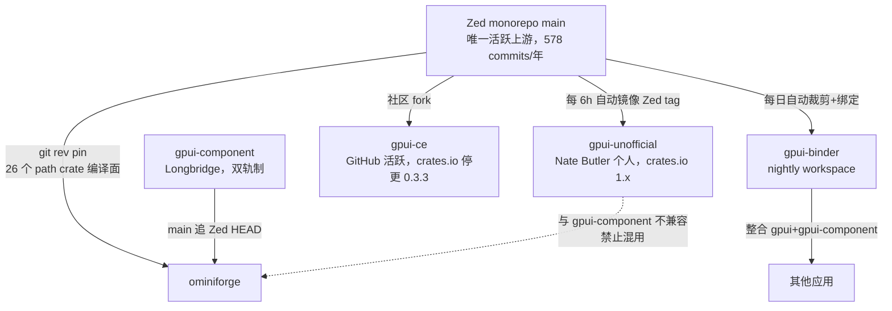
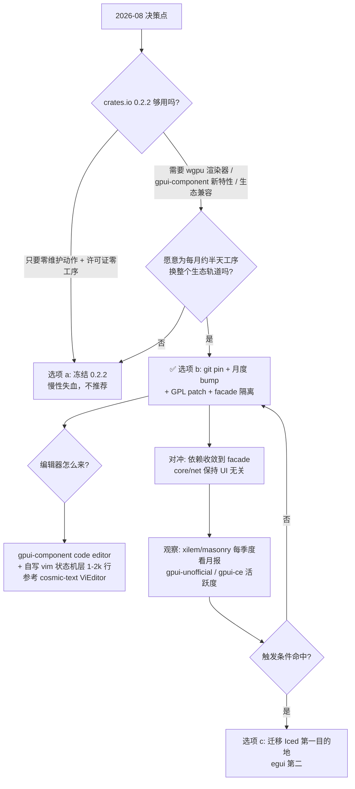
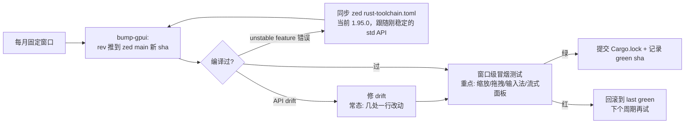

# ominiforge GUI 选型决策报告：GPUI 可持续使用策略

> 日期：2026-08-08 ｜ 读者：性能工程师（Rust/系统背景，无 GUI/前端/桌面开发经验）
> 项目：ominiforge —— 单人长期项目，Rust AI agent 工作台（LLM 流式对话、工具调用可视化、session 管理、usage/cost/trace 监控、文件树），许可证目标 MIT OR Apache-2.0。
> 本报告基于 12 个维度的深度调研、交叉验证（置信度分级：High / Medium / Conflict / 空白）与独立事实核查。正文关键结论均标注证据与置信度。

---

## 1. 结论速览（TL;DR）

**推荐：留在 GPUI，但立刻把消费方式从 crates.io 0.2.2 切换到 "git pin + 月度 bump + Cargo.lock + GPL patch + facade 隔离" 的有闸门押注（gated bet）姿势；编辑器走 gpui-component 内置 code editor + 自写 vim 状态机层；xilem/masonry 作为 2-3 年期权观察，不迁移。**

五条一句话论据：

1. **"Zed 官方不再为第三方维护 GPUI"已是公开事实**（置信度 High）：2025-12-12 Zed 工程师在 Discord 宣布"推后一切不直接服务 Zed 用例的工作"，同日以"无 Zed 用例"关闭第三方 PR #42905；crates.io `gpui` 0.2.2（2025-10-22）此后 9.5 个月零发布。继续用 0.2.2 = 接受永久冻结在旧世界（Linux 仍是已废弃的 Blade 渲染器，连官方示例都与之不兼容）[^1^][^2^][^3^]。
2. **但追踪 git 的实测成本很低**：真实项目 deckard 记录 2025-10 → 2026 中的跨度只需 4 类一行改动；月度 bump + 提交 Cargo.lock 是可复制的单人模板（置信度 High）[^12^][^13^]。git 版的代价是引入 ztracing/zlog（GPL-3.0-or-later）传染——已有 terminal-delight 的现成 patch 工序可切断，cargo deny 零例外通过（置信度 High）[^15^][^16^]。
3. **没有任何备选 GUI 在总分上胜过这个姿势**：Tauri 踩中你已弃用的 web 双端历史 + Linux WebKitGTK 在同款 AI chat 场景实测翻车；egui/iced 的编辑器全需自研；floem 唯一开箱 vim 模态但自身可持续性比 gpui 更差（发布停于 2024-11）；Slint 许可证一票否决（置信度 High）[^38^][^43^][^46^][^47^]。
4. **编辑器嵌入不构成换框架理由**（置信度 High）：gpui-component 内置 20 万行级 + LSP + tree-sitter 的生产级编辑器，是全 Rust 生态唯一"开箱即用且被商业产品 dogfood"的选项；缺的 vim 模态用 1-2 千行状态机补齐，cosmic-text 的 ViEditor 可直接参考（置信度 High/Medium）[^32^][^54^]。
5. **你的架构（core/net 与 UI 分层）恰好是对冲 GPUI 风险的标准答案**：把 GPUI 依赖收敛到 facade，触发条件满足时迁移成本被限制在 ui/app 两个 crate。风险从"系统性"降为"工序性"——而依赖工程正是你的主场能力。

---

## 2. Q1：GPUI 还值得继续投入吗

### 2.1 官方态度：不是"停滞"，是"明确撤场"（置信度 High）

先把三个时间点钉死，全部经独立核查证实：

- **2025-10-22**：crates.io `gpui` 0.2.2 发布。这是最后一个官方版本，截至 2026-08-08 共 9.5 个月零后续发布（无 0.2.3、无 0.3），crates.io API 一手数据[^3^]。
- **2025-12-12 18:25 UTC**：Zed 工程师 Mikayla Maki（GPUI 负责人、0.2.x 全部版本的发布者）在官方 Discord 宣布："GPUI develoment is getting some major brakes put on it … I'm going to be pushing off anything that isn't directly related to Zed's use case from now on"，并把社区导流至刚创建的 fork gpui-ce[^1^]。同日 18:23，她以同一口径关闭第三方贡献的自定义 shader PR #42905："without a Zed use case, I can't validate this code"[^2^]。gpui-ce 仓库在 18:40 创建——三事件同日同小时互锁（置信度 High；Discord 原文需登录，逐字内容来自 HN 转录，但与 GitHub 一手言论同日同口径互证）。
- **2026-04-29**：Zed 1.0 发布博文把 GPUI 完全定位为"自有技术栈"叙事（"we built it like a video game … writing our own UI framework, GPUI, from scratch"），对第三方只字未提[^4^]。社区在 discussion #55271 追问"1.0 后是否会重新发布 GPUI 到 crates.io"，截至 2026-08-08 **零回复**[^10^]；更早的 #30515（"Please extract GPUI"，要求把 GPUI 拆出 monorepo 独立发布）同样未见官方回应[^9^]。

诚实标注证据空白：**未找到任何官方博客/roadmap 级的正式政策声明**——正式渠道只有 Discord 发言 + PR 评论 + 社区转述。gpui.rs 网站仍挂着"Tomorrow, it's yours!"的口号，但内容停留在 0.2.x 时代，是刹车声明前的遗留物[^5^]。结论应表述为"官方以行动表明撤场"，而非"官方发文宣布放弃"。

### 2.2 0.2.2 冻结版 vs 追踪 git：风险对比

这是 Q1 的核心决策变量。先给结论：**这不是一个"新旧二选一"，真正的变量是许可证洁净度与生态轨道的权衡**（置信度 High，交叉验证修正项已采用）。

**crates.io 0.2.2（冻结版）**：依赖树干净（Apache-2.0，无 GPL，`sum_tree` 对应物是独立发布的 `gpui_sum_tree`）[^15^]；但它是 2025-10 的旧世界快照——Linux 用已被 Zed 废弃的 Blade 渲染器（NVIDIA/Wayland 长期冻结记录），没有 `gpui_platform` 拆分后的新 API，官方示例用 0.2.2 直接编译失败（issue #46183）[^8^]。生态（gpui-component 新特性、绝大多数新组件库）都在 git 轨道上，0.2.2 通道会持续被边缘化——组件库生态已明确站队分化：guise 这类冻结派死钉 crates.io 0.2.2（"no git pins, no patch sections"），而多数活跃新项目走 git 依赖[^26^]。

**git main（追踪版）**：拿到 wgpu Linux 渲染器（PR #46758，2026-02-13 合并，修复 NVIDIA/Wayland 冻结）与全部新 API[^7^]；代价有三，全部已被探明：

1. **GPL 传染**（置信度 High，经一手核查）：git 版依赖链 `gpui → sum_tree → ztracing/zlog/ztracing_macro`（三个 crate 均为 **GPL-3.0-or-later**，注意不是 GPL-3.0-only），且 gpui 对 ztracing 还有一条直接依赖边。这些 GPL crate 只被用于 trace-span 属性和一个测试 logger。terminal-delight 项目已用 patch（`0002-sever-gpl-crates.patch`）删除这些用法后，`cargo deny check` 零 GPL 例外通过，得以分发 MIT 二进制[^15^][^16^]。**对你的 MIT OR Apache-2.0 目标，走 git 版必须配套这道 patch 工序**（详见 §6.3）。
2. **编译面**：git 依赖需从 zed monorepo 编译 **26 个内部 path crate**（交叉验证修正：不是传言的 71 个；本地 sparse-clone 实测传递闭包），但每次 fetch 拉的是整个 zed 仓（锁文件 1863 个包）。一次性成本，Cargo.lock 锁定后无感[^13^]。
3. **API 漂移**：官方 README 明示 pre-1.0、breaking changes 常态、需要最新 stable Rust[^6^]。但实测漂移温和：deckard 记录 2025-10 → 2026 中跨度只需 4 类一行改动（`Application::new()` → `gpui_platform::application()`、`Menu.disabled` 新字段、`window.focus()` 加 `cx` 参数、`cx.update()` 不再返回 Result），月度 bump 每次预留半小时~半天修 drift + 冒烟测试即可（置信度 High，deckard/gpui-rsx/terminal-delight 三方互证）[^12^][^13^]。注意 wgpu 迁移后也出过新回归（0.225.12 窗口冻结，issue #50734）——**Conflict 区**：长期收益（统一渲染栈）与短期回归风险并存，bump 后需做窗口级冒烟测试[^14^]。

对比表：

| | crates.io 0.2.2 | git pin + 月度 bump |
|---|---|---|
| 许可证 | 干净（Apache-2.0） | 需 GPL patch 工序（已有现成方案） |
| Linux 渲染 | Blade（已废弃，NVIDIA/Wayland 冻结） | wgpu（2026-02 起，有新回归记录） |
| API | 冻结，官方示例已不兼容 | 最新，月度几处一行改动 |
| 生态兼容 | 只兼容 gpui-component crates.io 旧版 | 与 gpui-component main（官方推荐轨道）兼容 |
| 维护动作 | 零 | 每月一次 bump + 冒烟测试（约半天） |

### 2.3 Q1 结论

**值得继续投入，但投入的对象从"Zed 官方的 gpui"切换为"gpui 技术栈 + 社区生态"。** 两个支撑事实：

- **需求侧在升温**：Zed 官方 awesome-gpui 列表已收录 28+ 个第三方应用，其中 AI agent 工作台/终端是第一大品类（Arbor 792★、OxideTerm 958★、tty7、Codux 等）——你所在的赛道恰好是 GPUI 第三方生态里被验证最多的赛道（置信度 High）[^57^][^58^]；OxideTerm 的选型复盘直白记录了同一权衡："接受无 React 式原型的纯 Rust UI 约束，换渲染性能"[^66^]。crates.io 0.2.2 周下载在官方停更后仍在增长（2026-07 约 1.2 万/周，被 117 个 crate 依赖），需求增长与官方停更并存[^3^]。
- **供给侧在社区化**：官方撤场后 48 小时内社区自发补位（gpui-ce 同日创建），半年内形成了镜像发布（gpui-unofficial）、组件库（gpui-component）、自动化绑定（gpui-binder）的分工型基础设施（详见 Q2）。继续用 gpui 不再是"赌 Zed 良心"，而是"赌社区生态"——后者的证据更强。

**不应作为计划前提的事**：指望 crates.io 官方通道恢复更新。没有任何信号支持这一点（置信度 High）[^3^][^10^]。

---

## 3. Q2："用 gpui 但不依赖 Zed 发布"的可行模式

2026 年的 GPUI 第三方生态已形成"分工型基础设施"：镜像发布、组件库、绑定工具、升级工序各有专人负责，你不需要加入任何一方，只需消费。先给全景，再逐个裁决。



### 3.1 gpui-unofficial（Nate Butler 的全自动镜像）——可用，但不适合你

**是什么**（置信度 High，交叉验证修正项：gpui-unofficial ≠ gpui-ce，两者曾被张冠李戴）：Zed 前 1 号员工 Nate Butler 个人的全自动 crates.io 镜像——GitHub Actions 每 6 小时检查 Zed 新 release tag，转换重命名后发布 `gpui-unofficial` + 20 余个 `-gpui-unofficial` 后缀拆分 crate，版本号逐字对齐 Zed 版本（Zed v1.14.2 → gpui-unofficial 1.14.2）。2026-04-03 首版至 2026-08-05 已发 34 版[^20^][^21^]。

**优点**：唯一同时满足"crates.io 依赖 / 语义化版本 / 与 Zed 正式版一一对应 / 全自动"的方案；自动化设计使维护成本趋近于零。

**为什么对你不是主路线**：(a) **与 gpui-component 不兼容**——gpui-component 钉的是 zed git rev 或 crates.io 0.2.2，混入 gpui-unofficial 会产生"双 gpui 实例"（E0277 trait mismatch，gpui-component issue #2532 有完整复现），deckard 明确警告"never mix"[^12^][^31^]。你要用 gpui-component 的编辑器，就被锁在它的轨道上。(b) 镜像**无补丁能力**（版本号取自 Zed semver，遇 bug 只能等下一个 Zed tag），且引入 `ztracing-/zlog-gpui-unofficial` 同样的 GPL 问题[^21^]。(c) **Conflict 区**：单人 bus factor——全自动镜像人力风险低，但 Nate 2025-12-29 后已淡出 gpui-ce，且本人公开表示更想做一个"更贴合 Rust 生态的全新框架"（兴趣波动有据）[^11^]，若其停更无继任者。列为重估触发信号（见 §6.2）。

**定位**：如果你哪天决定放弃 gpui-component，它是最佳 fallback；现在作为观察项。

### 3.2 gpui-ce（Community Edition）——官方导流对象，但不宜押注

2025-12-12 Discord 声明中被官方点名的社区 fork。核查后的真实画像（置信度 High）：GitHub 活跃至今（2026-08-08 当天有提交，45 个 merged PR），但 **crates.io 发布停于 0.3.3（2025-12-27）**，crate owner 是 philocalyst 而非 Nate；Nate 本人在 gpui-ce 的提交全部集中在 2025-12-12~29，此后再无提交[^22^]。它自称与 gpui-component "100% 兼容"（drop-in + `[patch]` 路线）[^22^]。

**裁决**：GitHub 活跃与 crates 停更并存，说明它还没形成可靠的发布工序；社区早前的"落后主线 381 commit"质疑已被部分消化，但"可持续性未证实"的判断不变[^61^]。**不押注，但它是重要的生态缓冲**——如果 Longbridge 抽身 gpui-component、或 Zed 做出对第三方更敌对的动作，gpui-ce 是社区接管的候选落点。把它列为先行指标盯住，而不是依赖它。

### 3.3 open-gpui / Kael——回答的是另一个问题，排除

- **open-gpui**（Latias94，单人）：愿景最完整的硬 fork——包名全部改为 `open-gpui-*`、import 路径 `open_gpui::`、自建第一方生态（组件库/表单/devtools/docking 等），Apache-2.0、无 GPL crates。但它是 **API 已分叉的新框架而非 gpui**，3 stars、零外部采用、维护者同时在推进另一个 UI 框架[^23^]。对"用 gpui 而不追 zed git"的诉求**矫枉过正**：你得到的是一个生态为零的新框架。排除。
- **Kael**（原 adabraka-gpui，Augani）：adabraka-gpui 仓库已 404，项目更名 Kael 转型为独立产品框架（`kael = "0.3"`，自带签名自动更新/插件/IPC），不再是 gpui 兼容 fork。维护者有快速 pivot 史（fork 发版窗口约 2 周后沉寂，半年后改名重来）[^24^]。排除；其 daemon/tray/hotkey 特性集的思路可参考。

### 3.4 gpui-binder——把"追 zed git"外包给自动化的可行选项

纯 GitHub Actions 自动化仓库：每日 08:42 UTC 从 zed@main 裁剪出 GPUI 子集 + 导入 gpui-component@main，生成单一 `gpui_facade` 外观 crate 的 nightly 分支，消费方式为 git dependency + pin rev。调研当天上午仍在运转（置信度 High）[^25^]。

**裁决**：本质是"把追 zed git 的机械工作自动化外包"，而非消除它。它同时解决了配对陷阱（gpui 与 gpui-component rev 严格一致）。**可选增强项**：如果你不想自己维护月度 bump 工序，用它替换手动 bump 是合理的；代价是多一层归属不明的中间方（维护者身份未公开，生成产物只做了 `cargo metadata` 级验证，证据空白）。保守做法是先自建工序（§6.3），把它当备胎。

### 3.5 gpui-component 双轨制——你实际要跟随的轨道

置信度 High：crates.io 发布版（0.5.1，2026-02-05，钉 gpui ^0.2.2）与 git main（追 zed HEAD，版本号 0.5.2 未发布）双轨并行，**官方文档明确劝退 crates.io 轨道**："recently GPUI have some new features not published on crates.io, so we recommend using the git version for now. The documentation on this site are based on the Git main branch"[^27^][^28^]。crates.io 轨道已 6 个月空窗，"稳定版"心智名存实亡。

风险画像：仓库高度活跃（调研当天有提交，月 60-100+ commit，120 位贡献者，12.4k stars），但产出实质系于 huacnlee（1213 commits）+ madcodelife（387）两名 Longbridge 员工——**bus factor ≈ 2，且与雇主单一绑定**（置信度 High）[^30^]。缓冲：Apache-2.0 + 755 forks + Longbridge Pro 持续迭代（brew 2.38.7）这个商业锚点仍在[^68^]。另有两个如实标注的短板：huacnlee 提给 zed 的部分 PR 已因"不直接服务 Zed"被关，仓库内已在讨论社区 fork GPUI 的可能性（#1798/#1856，尚无实质进展）[^29^]；组件库本身被部分用户批评动画基础、i18n 简陋、依赖重编译慢（单一用户主观评价，具体可复核）[^67^]。

**裁决**：你的 gpui 来源轨道 = gpui-component 的轨道，即 **zed git + rev pin**。这是 Q2 的最终答案。

### 3.6 fork 自维护现实性——全面 fork 不可行，浅 fork 是兜底技术手段

置信度 High（本地 sparse-clone 实测）：GPUI 家族（gpui + 平台后端 + wgpu + web）当前 main 约 **12.9 万行 Rust**，三条原生渲染路径（Metal/DirectX/wgpu）、五个平台子系统（macOS/Windows/Wayland/X11/web），上游 578 commits/年。参照系：一个熟练工程师能长期独立维护的陌生代码量约 2-5 万行；a11y 一项参照 Godot 接 AccessKit 花了 2 年、3.2 万行[^63^]。历史上单人/小团队 fork GUI 框架成功的案例（Lite XL、Masonry）共同点是要么**上游冻结**、要么**有团队**——GPUI 两条都不满足[^64^][^65^]。

**结论**：全面 fork 自维护 = 不可行（置信度 High）。唯一被反复验证可行的模式是 **gpui-preview 式浅 fork**：补丁最小化（数百行级）、`[patch]` 注入、随时可弃。fork 从"维护策略"降级为"注入一两个补丁的技术手段"——GPL patch（§6.3）正是这个模式的实例。

### 3.7 Q2 结论汇总

| 模式 | 裁决 | 理由 |
|---|---|---|
| zed git + rev pin + 月度 bump | ✅ **主路线** | 实测成本每月约半天；与 gpui-component 官方推荐轨道一致 |
| gpui-unofficial | 🔶 观察/fallback | 唯一 crates.io 语义化通道，但与 gpui-component 不兼容、单人 bus factor |
| gpui-binder nightly | 🔶 可选增强 | 自动化外包 bump 工序；中间方归属不明，先做备胎 |
| gpui-ce | 🔶 先行指标 | GitHub 活跃但 crates 停更；可持续性未证实，盯住即可 |
| open-gpui / Kael | ❌ 排除 | 已分叉的独立新框架，生态为零 |
| 单人全面 fork | ❌ 不可行 | 12.9 万行 × 578 commits/年上游，无冻结上游无团队 |
| `[patch]` 浅 fork | ✅ 兜底技术手段 | 数百行级、随时可弃；GPL patch 即其实例 |

---

## 4. Q3：备选 GUI 框架对比

### 4.1 先补四个桌面开发概念（平实版）

后文对比表会反复用到这些词，先用系统工程师的语言对齐：

- **渲染管线**：把"一个按钮"变成屏幕像素的流水线。GPUI/egui/iced 这类"GPU 加速 GUI"的做法是：CPU 把界面翻译成一堆三角形和字形图集，交给 GPU 批量画出——和你熟悉的批处理管线同构，瓶颈通常在 CPU 侧的文字排版而不是 GPU 光栅。Tauri/Dioxus 则是把 UI 交给系统自带浏览器引擎（WebView）渲染，你拿不到 GPU 控制权；前后端靠 JSON 桥（IPC）传话，流式数据要走专门的 Channel API，事件系统官方明示不适合高频大吞吐[^42^]。
- **Retained vs Immediate mode**：Retained（保留模式，如 Qt、浏览器 DOM、Iced/GPUI 的视图层）是框架替你保管一棵控件树，数据变了局部刷新；Immediate（即时模式，如 egui）没有控件树，你的代码每帧从头跑一遍，边跑边当场画 UI、当场返回"这帧按钮被按了没"。即时模式状态全在你自己的 struct 里（对性能工程师最透明），代价是超长列表必须手动裁剪，否则每帧全量布局。
- **Elm 架构**（Iced）：整个应用就是一个状态机——`Model`（一个装全部 UI 状态的 struct）+ `Message`（一个列举所有可能事件的 enum）+ `update(&mut self, msg)` 改状态 + `view(&self)` 纯函数描述 UI。数据流单向，编译器强迫你处理每种事件。与你的 agent 事件循环后端同构。
- **IME（输入法编辑器）与 a11y（无障碍）**：IME 是中文/日文输入的"拼音→候选词→确认"机制，框架必须显示带下划线的预编辑文本并把候选窗定位到光标附近，Linux 下要对接 XIM 和 Wayland text-input 两套分裂的机制——**这是桌面开发水最深的坑之一**，直接决定中文用户能否输入。2025 年 40+ 个 Rust GUI 库的横评中 GPUI 的 IME 评价为"能用"（读屏器则为"不可用"）[^33^]，但坑仍在：GPUI 的 Windows 中文 IME 候选窗与按键互相干扰的问题到 2026-05 仍未解决[^62^]。a11y 是让读屏软件"看见"你的 UI；自绘 UI 对读屏器是一团像素，必须额外通过 AccessKit 等库上报结构化信息，参照系是 Godot 接 AccessKit 花了 2 年 3.2 万行[^63^]。对单人项目，a11y 的正确姿势是"搭上游便车或放弃"。

### 4.2 大对比表

评分口径：对**你的画像**（单人、性能工程师、不懂前端/桌面、MIT OR Apache-2.0、远期 vim 编辑器、键位手感重要）的负担与适配，非框架绝对优劣。学习曲线与"单人负担"列以 1-5 计（5 = 最轻松/负担最小）。

| 框架 | 学习曲线 | GPU 加速 | 模态键位 | 编辑器嵌入路径 | 社区/文档/长期维护 | 许可证 | 对单人非桌面专家的负担 | 总评 |
|---|---|---|---|---|---|---|---|---|
| **GPUI**（现状） | 3（API churn + 文档稀缺，靠读 Zed 源码考古） | 5（Metal/DX/wgpu 三后端，为编辑器打磨） | 3（原始键事件齐全，模态自写；Zed vim mode 可观摩不可复用） | **gpui-component 内置生产级编辑器**（200K 行/LSP/tree-sitter），无 vim 需自写状态机 | 官方撤场（High）；社区生态升温但小众；文档稀缺 | Apache-2.0（git 版需 GPL patch 工序） | 2-3：GUI 编程本身不难，负担集中在依赖工程——恰好是你的主场 | **主线（gated bet）** |
| **egui** | 5（Rust GUI 最低门槛；即时模式对系统工程师反而直觉） | 4（wgpu；瓶颈在 CPU 文本布局，大文本卡顿有据[^36^]） | 3（原始键事件齐全但零内置 keymap，内置快捷键硬编码不可关） | **全自研**：ropey+syntect+虚拟滚动，Ferrite 已验证（~14k 行、100MB 文件流畅）[^37^] | **最高档**：Rerun 赞助、30k★、月百万下载、年 3-4 版（High）[^34^][^35^] | MIT OR Apache-2.0 | **4-5：负担最小**，但天花板低 | 最强备选；编辑器是天花板 |
| **Iced** | 4（Elm 架构对 Rust 人友好，无魔法；widget 自研比例高） | 3-4（wgpu + 0.14 反应式渲染；无内置虚拟列表） | 4（physical_key + 全局订阅 + 可编程焦点；COSMIC Edit/iced-code-editor 两个 vim 先例[^40^][^41^]） | 内置 text_editor + 第三方 iced-code-editor（MIT，vim MVP）[^40^]；严肃 vim 编辑器仍需自研 | 31k★、COSMIC 全桌面 dogfood、1.0 在即；发版慢（0.14 后 8 个月无补丁版） | MIT | 4：认知负担最低的 retained 框架；无内置虚拟列表需自建 | 第二备选；迁出案例的目的地[^60^] |
| **Tauri** | 2（双端：JS/TS 前端 + Rust 后端 + npm 生态，恰是你已弃用的模式） | 2-3（系统 WebView 渲染，无原生 GPU 控制；**Linux WebKitGTK 在同款 AI chat 场景实测翻车**[^43^]） | 3（可做，但 WebView 焦点黑洞与浏览器保留键是持续地雷） | **最强**：CodeMirror 6 + @replit/codemirror-vim（MIT），vim 手感天花板[^45^] | **最大生态**（~109k★、五年连续发版、Commons Conservancy 治理） | MIT/Apache | 1-2：**双端成本正中你已弃用的历史**；三端 WebView 差异 QA | 一张王牌（编辑器）换三个核心诉求踩雷，否决 |
| **Slint** | 4（DSL 简单、工具链优秀） | 4（Skia 默认 + 可选 wgpu） | 3（1.16 新增声明式快捷键；模态/序列键全自建） | 无编辑器组件；TextEdit 大文档卡顿有据；需自绘 | 公司化运营、1.x 三年稳定 | **GPLv3 / 自定义 Royalty-free（带署名义务）/ 付费商业——无 MIT/Apache 路径**[^46^] | — | **许可证一票否决**（置信度 High）[^46^] |
| **Dioxus** | 3（RSX 易学，但 HTML/CSS/Tailwind 不可回避） | 3（webview 路径同 Tauri 天花板；原生 Blitz 渲染器 pre-alpha，官方自评不可用） | 4（浏览器级键事件 + Rust 侧状态机） | webview 模式可嵌 CodeMirror（需 eval 自行拼装，无官方集成）；Blitz 模式不可行 | 34k★、全职小队、0.x 连续 breaking | MIT OR Apache-2.0 | 3：消除双端 IPC 但继承 webview 天花板 + 前端知识门槛 | 观望项；两头不占 |
| **floem** | 3（文档中等，生态小） | 4（wgpu + 可选 Vello） | 4（编辑器内核自带 Modal 模态） | **唯一开箱 vim 模态**（floem-editor-core，lapce 编辑器内核，MIT）[^47^][^48^][^49^] | **差**：crates.io 停于 0.2.0（2024-11），与 lapce 命运绑定（lapce 2024 后放缓、社区志愿者维护） | MIT | 2-3：生态小、非 lapce 场景打磨度存疑（Discussion #824 无人答） | 编辑器王牌但框架级风险高于 gpui，不单独构成换框架理由 |
| **xilem/masonry** | 2-3（alpha，breaking 常态） | 5（Vello GPU compute，上限最高；Parley/AccessKit 创始级集成，理念最超前） | 未评估（无编辑器组件，一切自建） | 无（需完全自建，但 Parley/AccessKit 是最好的自建底座） | **可持续性第二梯队最佳**：多人组织 + NLnet 两项资助 + 月更；但仍 alpha、"not production ready"[^50^][^51^] | Apache-2.0 | 2：alpha + 无编辑器组件，现在押注 = 替 Linebender 当测试用户 | **2-3 年期权观察**（每季度看月报），不是 2026 年选项 |
| **vizia** | 3 | 3（Skia，带 C++ 依赖） | 未评估 | 无 | 单人维护为主，0.4.0（2026-04）刚大改响应式系统；定位偏音频插件 | MIT | 2-3 | 与本场景无增量价值，排除 |
| **makepad** | 2（自有 DSL + 脚本引擎 + 非 wgpu 自有渲染 + 推荐 nightly） | 4（自有 shader 渲染器，性能强） | 未评估 | 有 Studio IDE 但深度绑定自家运行时 | 3 人核心、无基金会、资金不透明（中高置信，第三方调研）[^52^][^53^] | MIT（已核实无坑）[^52^] | 1-2：**生态锁定深，进去容易出来难**，与"单人长期维护"冲突 | 参考其 live-editing 理念即可，排除 |

（freya / ribir / kas / cushy 等第二梯队均为单人研究性质项目、无生产用户背书，统一排除，不再展开。）

### 4.3 对比的三个关键判断

**判断一：维护负担排序 ≠ 流行度排序。** 流行度最高的 Tauri 恰恰最不适合你（双端成本 2/5，且与你"已弃 web 端、体验割裂"的历史直接冲突——选 Tauri ≈ 重新拥抱你逃离过的开发模式；IPC 传大 payload 实测也慢，3MB 约 200ms[^44^]）；负担最低的 egui 在编辑器与模态键位上天花板明显；gpui 的"负担"主要来自依赖管理而非 GUI 编程本身——而依赖管理恰好是你（Rust/系统工程师）的主场能力。**gpui 的风险结构与你的能力结构互补**（置信度 High，跨维度洞察）。

**判断二：迁移的真实成本不只是学习新框架。** 你的护城河是 UI 无关的 core/net 分层，迁移成本被限制在 ui/app 两 crate——但 gpui 特有的 Entity/Context 所有权模型、gpui-component 的 60+ 组件与 Dock 系统、以及你已写的自研组件，全部要重写。唯一公开迁出案例 typst-studio → Iced（2026-03）证明 Rust 原生圈内迁移可行，但该项目的迁移理由未在仓库中成文（置信度：事实 High / 原因"未找到"，合理推测与其双向文本排版需求有关）[^60^]。没有项目公开记录从 GPUI 迁往 Tauri/Electron（阴性结论，置信度 Medium）[^61^]。

**判断三：egui 与 Iced 是仅有的两个"认真备选"，但都输在编辑器这一单项。** egui 的维护确定性是 Rust GUI 最高档、学习门槛最低，但内置 TextEdit 大文本卡顿有据（1500 万字符时每次插入 >1 秒，issue #3086 至今未根本解决）[^36^]，严肃编辑器只能按 Ferrite 模式自研（ropey + 虚拟滚动，~14k 行）[^37^]；Iced 的 Elm 架构对你最友好、vim 键位原料最齐全（physical_key + COSMIC Edit/iced-code-editor 两个先例），但无内置虚拟列表、无生产级编辑器组件（iced-code-editor 的 vim 是 MVP，月下载仅 44）[^40^]；且 Iced 发版节奏慢、PR 审查"可能数月"，遇框架 bug 要有本地 patch 的心理准备[^39^]。两者的编辑器路径工作量都**大于**"留在 gpui + gpui-component 编辑器 + 自写 vim 层"。**如果未来触发迁移，Iced 是第一目的地**（唯一公开迁出案例的目的地也是它[^60^]）。

---

## 5. Q4：编辑器嵌入对选型的约束

### 5.1 先拆编辑器：一个"编辑器"是五层

写给不碰文本编辑器内部的读者，后面所有路径讨论的都是"哪几层有现成货、哪几层自己写"：

1. **文本缓冲区**：大文件不能在 `String` 中间插入（要搬后面所有字节）。编辑器用 **rope**（文本切块挂树，任意位置插入/删除 O(log N)，整文档克隆几乎免费）。Rust 里直接选 `ropey` 即可（MIT，Helix、gpui-component 都在用，作者承诺 1.x 长期维护）[^55^]。
2. **塑形与渲染**：把 Unicode 字符 + 字体变成带位置的字形——连字、BiDi、emoji、字体回退都在这层，**水最深，绝不自写**。Rust 事实标准是 `cosmic-text`（System76 出品，MIT/Apache，Iced/Floem/COSMIC 桌面采用），它**自带 `Editor` 甚至 `ViEditor`（vim 模态封装）**——这是被低估的资产（置信度 Medium-High）[^54^]。
3. **语法高亮**：tree-sitter（增量解析、真语法树，Zed/Helix/gpui-component 的选择，每种语言带一个 C grammar crate）vs syntect（正则规则、开箱几百种语言，egui/iced 生态常用）。都成熟。
4. **撤销**：无公认开箱 crate；rope 的廉价克隆让快照式撤销成本很低，helix-core 的 History（撤销树）可参考。
5. **虚拟滚动**：十万行文件只布局/绘制视口内可见的几十行；定高等宽字体下不难，软换行/变高行是长尾 bug 源。

**类 vim 模态编辑的本质是一个状态机**：Normal/Insert/Visual 模式 + "[次数] operator motion" 语法解析（`d2w` = delete + 2×word）。只实现常用 30-50 个键位（覆盖 vim 手感 80%）是 1-2 千行 Rust 的量级（参照 cosmic-text ViEditor / edtui 的规模），不追求寄存器/宏/Ex 命令不算大工程（置信度 Medium，估算非测量）。你已否决 zed editor crate（GPL + 40 crate 耦合）、libnvim、`nvim --embed`——本次调研无新证据推翻，维持否决。

### 5.2 路径对比表

| # | 路径 | 绑定 GUI | 到"vim 手感"的工作量 | 许可证 | 主要风险 |
|---|---|---|---|---|---|
| 1 | **gpui-component code editor + 自写 vim 状态机层** | GPUI | 编辑器开箱（200K 行/LSP/tree-sitter/ropey）；在其 InputState 单光标模型上拦截按键、加模态状态机、自绘块光标（约 2-4 周）；多光标/寄存器要改底层 | Apache-2.0 | 官方无 vim 支持且无 roadmap 迹象（穷尽阅读文档+changelog 的"未找到"结论，置信度 High）[^32^]；魔改 InputState 遇升级可能冲突 |
| 2 | **floem 内置编辑器 + modal 模式** | Floem | 最小：编辑器与模态开箱即有（floem-editor-core 的 Mode/Movement/Register），需自接 keymap→command 管线（数天~1-2 周）[^48^][^49^] | MIT | floem crates.io 停于 2024-11 需 git pin；生态小；非 lapce 场景打磨度待验证（Discussion #824 无人答，置信度 Medium）；vim 覆盖度不如真 vim |
| 3 | **自研：ropey + cosmic-text(ViEditor) + tree-sitter + 自写撤销/虚拟滚动** | 任意能自绘文本的 GUI | 4-8 周到"手感正确的小而美"；塑形/光标/编辑动作/vim 状态机由 cosmic-text 解决大半 | 全 MIT/Apache | 长尾 bug（软换行、BiDi、IME 边界）；单人维护面最大 |
| 4 | **iced-code-editor / 自包 cosmic-text ViEditor widget** | Iced | 3-6 周；iced 底层就是 cosmic-text，理论摩擦力最小[^40^] | MIT | iced-code-editor 的 vim 是 MVP（无 text objects/宏/寄存器，月下载 44）；无人兜底 |
| 5 | **egui 自研（Ferrite 模式）** | egui | 数月（Ferrite 实证 ~14k 行，性能天花板自己掌控）[^37^] | MIT | 无脚手架；egui TextEdit 模型不适合大编辑器[^36^] |
| 6 | **WebView + CodeMirror 6 + @replit/codemirror-vim** | Tauri/Dioxus（或 gpui-component 的实验性 wry feature） | vim 手感开箱最佳（motions/text objects/宏/Ex 命令/自定义 operator 全有，Replit 维护）[^45^] | MIT | WebView 架构税：Rust↔JS 桥、状态两语言同步、主题字体一致性；且有已知手感缺陷（Ctrl+U/D 半页滚动失效、IME 在 normal 模式可输入等） |
| 7 | **helix-core 当库嵌入** | 需自写 GUI 前端 | 极大且 unsupported：crate 未发布 crates.io（839 字节占位包）、无嵌入 API、事件模型绑定终端[^56^] | MPL-2.0（本身商业友好） | 实质不可行；只能当设计参考/选择性移植（移植文件仍 MPL） |
| 8 | **前期简化：多行 input 应付，远期再升级** | 任意 | 0 | — | 各路线均成立 |

### 5.3 明确回答：编辑器嵌入是否足以成为换框架的理由？

**否。不构成换框架理由。**（置信度 High，跨维度洞察）

推理链：

1. **留在 gpui 的编辑器选项不劣于任何换框架选项**。路径 1（gpui-component 编辑器 + 自写 vim 层）拿到的是全 Rust 生态唯一"生产级 + 被商业产品 dogfood + 与 GUI 同栈"的编辑器（第三方评测称 "VS Code-grade"，Longbridge Pro 每日运行背书）[^32^][^59^]，缺的 vim 层是 1-2 千行量级、且 cosmic-text ViEditor 与 floem-editor-core 提供可抄的参考实现[^54^][^49^]。
2. **唯一在编辑器维度更强的两个选项，都在框架维度更差**。floem（路径 2）开箱 vim 模态领先一个身位，但 floem 自身可持续性（发布停 21 个月、绑定 lapce）是**框架级风险**，高于 gpui 的**生态级风险**——用一个更差的框架去换一个更好的组件，方向反了。WebView 路线（路径 6）vim 仿真度最高，但带回你已弃用的双端成本 + Linux WebKitGTK 实测翻车[^43^]。
3. **各路线的编辑器选项优劣与框架选择基本正交**：egui/iced 一律自研，工作量大于路径 1；没有任何换框架选项在编辑器维度上同时胜过"留在 gpui"。
4. **vim 状态机层与底层解耦设计可跨方案复用**（helix 的 helix-core vs helix-term、floem 的 floem-editor-core vs floem views 是同一个架构结论）：键序列→编辑命令写成纯函数核心，无论未来是否迁移框架，这层都不浪费。这进一步降低了"现在选错"的代价。

**例外条款**（诚实边界）：如果"vim 手感"从远期需求升级为**产品核心交互**（用户每天在 vim 模式里编辑数小时），且 gpui-component 编辑器 + 自写 vim 层在实践中被证明手感不达标，则 floem 的权重应上调重估——届时 floem 用现成资产省 1-2 个月且手感有保证。这列入 §6.2 的触发条件。

---

## 6. Q5：决策建议

### 6.1 四个选项与推荐

- **a) 留在 crates.io gpui 0.2.2（冻结版）**：许可证最干净、维护动作最少，但永久停在 Blade 渲染器与旧 API，生态持续边缘化。这是"慢性失血"选项。
- **b) 留在 gpui + 切换 git pin 追踪（gated bet）**：拿到 wgpu 渲染器与全部生态红利，代价是每月约半天的依赖工序 + GPL patch。这是"把风险从系统性降为工序性"的选项。
- **c) 迁移 Iced / egui**：治理确定性最高，但编辑器路径工作量更大、现有 gpui 组件资产清零重写。
- **d) 迁移 floem / Tauri**：floem 框架级风险更高；Tauri 正中三条核心诉求的反面。均不成立。



**推荐：选项 b 为主，叠加 Q4 结论（编辑器 = gpui-component code editor + 自写 vim 状态机层），xilem/masonry 作为 2-3 年期权每季度观察。** 不选 a（冻结即慢性失血）；不选 c（编辑器单项劣势 + 迁移成本无对冲收益，除非触发条件命中）；不选 d。

理由回顾（全部前文已证）：官方撤场已是事实但生态在补位（§2）；git 追踪实测成本每月约半天（§2.2）；GPL 传染有现成 patch 工序（§2.2、§6.3）；备选框架无一总分胜出（§4）；编辑器不构成换框架理由（§5.3）；你的 core/net 分层使"继续用 gpui"与"保留换框架能力"不矛盾——这是 gated bet 能成立的结构性原因。

### 6.2 重新评估触发条件（具体、可观测的信号清单）

每季度检查一次；命中**任意一条红色信号**即启动迁移评估（第一目的地 Iced），命中黄色信号则收紧依赖策略（更长的 bump 间隔、更深的 vendor 隔离）。

**红色信号（启动迁移评估）：**

1. **gpui-component 失锚**：huacnlee 或 madcodelife 宣布退出、Longbridge Pro 桌面端停止更新、或仓库连续 3 个月零 commit。（它是你编辑器与组件的唯一来源，bus factor≈2 是全链条最脆的一环，置信度 High）[^30^]
2. **API 漂移成本失控**：单次月度 bump 的适配工作量连续 2 次超过 2 天（当前基线：10 个月跨度 4 处一行改动[^12^]），或 zed 上游做出破坏 facade 隔离层的架构变更（如再次 crate 拆分且 gpui-binder 等自动化管线跟不上）。
3. **GPL 面扩大**：zed 上游把 GPL-3.0-or-later 依赖扩展到 patch 无法简单切断的位置（例如 GPL 代码进入渲染路径而非仅 trace 注解），使 §6.3 的 patch 工序失效。
4. **Zed 对第三方采取主动敌对动作**：修改 gpui 许可证、或明确要求下游项目停止使用（当前姿态是"不服务"而非"禁止"，注意区分）。
5. **编辑器升级为核心交互且手感不达标**：gpui-component 编辑器 + 自写 vim 层实测手感不可接受，且 floem 恢复 crates.io 发布节奏——此时重估 floem 路线（§5.3 例外条款）。

**黄色信号（收紧策略，不迁移）：**

6. **gpui-unofficial 停更**：34 版后连续 2 个 Zed release tag 未镜像——单人 bus factor 兑现，fallback 通道关闭（Conflict 区，无解决路径）[^21^]。
7. **gpui-ce 消失或长期停滞**：它是社区接管的候选落点，消失意味着"两层上游同时失锚"情景的缓冲变薄[^22^]。
8. **wgpu 渲染器再出窗口级回归**（参照 0.225.12[^14^]）：拉长 bump 间隔到季度，bump 前先看 zed issue 跟踪器。
9. **xilem/masonry 发布 1.0 或出现生产级编辑器组件**：期权升值信号——把"2-3 年后重估"提前（当前为 alpha，置信度 Medium）[^50^][^51^]。

### 6.3 留在 gpui 的"最小痛苦姿势"（工程清单）

照抄 deckard 公式 + terminal-delight 工序即可，全部是已验证的现成做法[^12^][^13^][^15^][^16^]：

**依赖方式（Cargo.toml）：**

```toml
# 单一事实来源：workspace 级集中声明，应用 crate 一律 workspace = true
[workspace.dependencies]
gpui          = { git = "https://github.com/zed-industries/zed", rev = "<pin-sha>" }
gpui_platform = { git = "https://github.com/zed-industries/zed", rev = "<pin-sha>", features = ["font-kit", "x11", "wayland"] }
gpui-component = { git = "https://github.com/longbridge/gpui-component", rev = "<pin-sha>" }
```

- **rev 锁死 + 提交 Cargo.lock**：可复现性的全部来源。gpui 与 gpui-component 的来源/rev 必须严格一致——混用不同 rev 会产生"双 gpui 实例"，编译通过但调用点报 E0277 trait mismatch（最高发陷阱，有完整复现记录）[^31^]。
- **绝不混用 gpui-unofficial 与 gpui-component**[^12^]。
- 保留一条注释掉的 crates.io 回退通道（`gpui = "0.2"` + `gpui-component = "0.5"`）作为零-git 应急兜底，代价是回到 2025-10 快照。

**版本策略（月度 bump 工序）：**



- 节奏：**月度足够**，不要追每个 commit[^12^]。bad bump 是常态事件（gpui-component 约 1/5 发布被 yank、gpui HEAD pre-1.0），预案就是"待在 last green，下月再来"[^12^]。
- toolchain 跟随 zed 的 rust-toolchain.toml（当前 1.95.0；gpui 会立刻消费刚稳定的 std API）[^17^]。
- bump 前花 5 分钟扫一眼 zed 的 gpui 目录近期 commit 与 gpui-component 的 `chore: Bump gpui` 提交，预知结构性事件（每年 1-2 次，如仓拆分、渲染器替换，各预留 1-3 天）。

**GPL patch 工序（分发二进制前必做）：**

git 版经 `gpui → sum_tree → ztracing/zlog/ztracing_macro`（GPL-3.0-or-later）带入传染（gpui 对 ztracing 另有直接依赖边），这三个 crate 只用于 trace-span 注解与测试 logger[^15^]。照 terminal-delight 的现成方案执行：

1. vendor zed 的 `sum_tree`（必要时含 `gpui`）为本地浅 fork；
2. 应用 `0002-sever-gpl-crates.patch` 等价改动：删除 Cargo.toml 中 `ztracing/zlog` 依赖行 + 移除源码中 `use ztracing::instrument`、`#[instrument(skip_all)]`、`zlog::init_test()` 调用（纯注解代码，删除不影响功能）[^16^]；
3. `[patch]` 段注入，对全依赖树透明；
4. CI 里跑 `cargo deny check licenses`（allowlist 仅 Apache/BSD/MIT 类），**零 GPL 例外为合并门禁**；发布物附 `cargo about` 许可证清单[^15^]。
5. 补丁保持最小化、随时可弃（gpui-preview 模式）[^13^]。同时把 RUSTSEC-2026-0192（ttf-parser 停维，gpui 直接依赖）与 RUSTSEC-2026-0206（rustybuzz 停维，经 usvg 传入）记入 deny.toml 豁免并跟踪 skrifa/harfrust 迁移——均为 info 级 unmaintained 公告，非漏洞[^18^][^19^]。

**facade 隔离（隔离上游变动的工程做法）：**

- **core/net 保持零 GPUI 依赖**（现状即正确，deckard 的 `deckard-core` "No GPUI dependency; fully unit-testable" 是同款模式）[^13^]——这是对冲的根基，让 §6.2 触发条件命中时重写面只限于 ui/app。
- ui crate 内部再加一层薄 facade：业务代码不直接散落 gpui / gpui-component API，编辑器、Dock、主题、action/keymap 注册等重依赖点各包一个本 crate 的接口。目标不是抽象掉 gpui（不值得），而是让"上游 API 漂移"和"未来换框架"两类冲击都收敛到可枚举的接触面。
- vim 状态机层从第一天就写成"键序列→编辑命令"的纯函数核心，与 gpui-component 的 InputState 解耦——这层在任何迁移情景下都可复用（§5.3-4）。
- 平台差异（如托盘、快捷键差异）在应用层用 `#[cfg(target_os)]` 吸收，不 fork 框架；参照 deckard：GPUI 事件循环就是标准平台 run loop，托盘可用 `tray-icon` crate 在 app 层桥接[^13^]。
- 遇到框架 bug 的默认顺序：**应用层 workaround → 等 gpui-component 修（组件层 bug 响应快）→ `[patch]` 浅 fork（平台层、最小化、可弃）**。深改渲染/IME 管线永远不做（12.9 万行 × 578 commits/年上游，单人不可行，置信度 High）。

---

## 7. 参考来源清单

调研与核查日期均为 2026-08-08（另有标注的除外）。置信度分级依据 gpui_strategy_cross_verification.md。

[^1^]: Hacker News 评论（逐字转录 Zed Discord 声明，Discord snowflake 解码 2025-12-12 18:25 UTC）https://news.ycombinator.com/item?id=47003569 ，2026-02-13。
[^2^]: zed-industries/zed PR #42905 关闭评论（"without a Zed use case, I can't validate this code"）https://github.com/zed-industries/zed/pull/42905#issuecomment-3647662949 ，2025-12-12。
[^3^]: crates.io gpui 版本 API（0.2.2 = 2025-10-22，此后零发布；周下载 12,139 @2026-07-28）https://crates.io/api/v1/crates/gpui ，抓取 2026-08-08。
[^4^]: Zed 1.0 发布博文 https://zed.dev/blog/zed-1-0 ，2026-04-29。
[^5^]: gpui.rs 官网（内容停留 0.2.x API）https://gpui.rs/ ，抓取 2026-08-08。
[^6^]: zed 仓 crates/gpui/README.md（"pre-1.0 … breaking changes … latest stable Rust"）https://github.com/zed-industries/zed/blob/main/crates/gpui/README.md ，抓取 2026-08-08。
[^7^]: zed PR #46758（Linux 渲染器 Blade → wgpu）https://github.com/zed-industries/zed/pull/46758 ，2026-02-13。
[^8^]: zed issue #46183（crates.io 0.2.2 与官方示例不兼容）https://github.com/zed-industries/zed/issues/46183 ，2026-01-06。
[^9^]: zed Discussion #30515（Please extract GPUI，未见官方回复）https://github.com/zed-industries/zed/discussions/30515 ，2025-05-11。
[^10^]: zed Discussion #55271（1.0 后是否重新发布 GPUI 到 crates.io，0 回复）https://github.com/zed-industries/zed/discussions/55271 ，2026-04-30。
[^11^]: HN 评论（Nate Butler：兴趣转向全新框架）https://news.ycombinator.com/item?id=47005761 ，2026-02-13。
[^12^]: hellno/deckard docs/UPGRADING.md（月度 bump、Cargo.lock、回滚预案、"gpui-component yanks ~1 in 5"、禁止混 gpui-unofficial）https://github.com/hellno/deckard/blob/main/docs/UPGRADING.md ，2026-06-05。
[^13^]: hellno/deckard docs/LEARNINGS.md（Oct-2025→mid-2026 仅 4 类一行改动；crate 拆分记录；app 层托盘桥接）https://github.com/hellno/deckard/blob/main/docs/LEARNINGS.md ，2026-02-13。
[^14^]: zed issue #50734（wgpu 迁移后 0.225.12 窗口冻结回归）https://github.com/zed-industries/zed/issues/50734 ，2026-03-04。
[^15^]: parker-brown-family/terminal-delight docs/PLAN.md（GPL 链分析、cargo deny 零例外、git pinned rev 决策）https://github.com/parker-brown-family/terminal-delight/blob/main/docs/PLAN.md ，2026-06-15。
[^16^]: terminal-delight docs/patches/0002-sever-gpl-crates.patch（切断 ztracing/zlog 的现成 patch）https://github.com/parker-brown-family/terminal-delight/blob/main/docs/patches/0002-sever-gpl-crates.patch ，抓取 2026-08-08。
[^17^]: zed 仓 rust-toolchain.toml（channel = "1.95.0"）https://github.com/zed-industries/zed/blob/main/rust-toolchain.toml ，抓取 2026-08-08。
[^18^]: RUSTSEC-2026-0192（ttf-parser unmaintained；gpui 直接依赖 ttf-parser 0.25）https://rustsec.org/advisories/RUSTSEC-2026-0192 ，2026-06-28。
[^19^]: RUSTSEC-2026-0206（rustybuzz unmaintained，经 usvg 传入 gpui 树）https://rustsec.org/advisories/RUSTSEC-2026-0206 ，2026-07-11。
[^20^]: iamnbutler/gpui-unofficial（全自动镜像 README：版本逐字对齐 Zed tag、每 6h 检查、无补丁能力）https://github.com/iamnbutler/gpui-unofficial ，抓取 2026-08-08。
[^21^]: crates.io gpui-unofficial（34 版，最新 1.14.2 @2026-08-05；owner = Nate Butler）https://crates.io/crates/gpui-unofficial ，抓取 2026-08-08。
[^22^]: gpui-ce/gpui-ce（2025-12-12 创建；GitHub 活跃至 2026-08-08，45 merged PR；crates 停更 0.3.3 @2025-12-27；与 gpui-component "100%" 兼容声明）https://github.com/gpui-ce/gpui-ce ，抓取 2026-08-08。
[^23^]: Latias94/open-gpui（独立 Apache-2.0 硬 fork，API 已分叉，3 stars）https://github.com/Latias94/open-gpui ，抓取 2026-08-08。
[^24^]: Augani/kael（原 adabraka-gpui 更名转型；adabraka-gpui 仓库 404）https://github.com/Augani/kael ，2026-08-07。
[^25^]: gpui-binder/gpui-binder（每日 08:42 UTC 自动绑定 zed@main + gpui-component@main）https://github.com/gpui-binder/gpui-binder ，抓取 2026-08-08。
[^26^]: wess/guise（crates.io 0.2.2 冻结派代表；gpui 生态组件库对比表 "as of July 2026"）https://github.com/wess/guise ，抓取 2026-08-08。
[^27^]: gpui-component 官方站点（"we recommend using the git version for now … documentation … based on the Git main branch"）https://longbridge.github.io/gpui-component/ ，抓取 2026-08-08。
[^28^]: crates.io gpui-component（v0.5.1 @2026-02-05，依赖 gpui ^0.2.2；24 版，79k+ 下载）https://crates.io/crates/gpui-component ，抓取 2026-08-08。
[^29^]: gpui-component Discussion #1856（上游拒绝社区 PR、gpui-ce 落后主线 381 commit 的担忧）https://github.com/longbridge/gpui-component/discussions/1856 ，2025-12-26。
[^30^]: GitHub API：longbridge/gpui-component contributors（huacnlee 1213 / madcodelife 387 / 第三名 32；bus factor≈2）https://api.github.com/repos/longbridge/gpui-component/contributors ，2026-08-08。
[^31^]: gpui-component issue #2532（双 gpui 实例 E0277 复现）https://github.com/longbridge/gpui-component/issues/2532 ，2026-07-03。
[^32^]: gpui-component Editor 文档（200K 行、LSP、tree-sitter、ropey；无 modal/vim 条目——穷尽阅读的"未找到"结论）https://longbridge.github.io/gpui-component/docs/components/editor ，抓取 2026-08-08。
[^33^]: boringcactus, A 2025 Survey of Rust GUI Libraries（GPUI IME "works"、读屏器 "nope"）https://www.boringcactus.com/2025/04/13/2025-survey-of-rust-gui-libraries.html ，2025-04-13。
[^34^]: emilk/egui README（immediate mode 说明、1-2ms/帧、Rerun 赞助、MIT OR Apache-2.0）https://github.com/emilk/egui ，抓取 2026-08-08。
[^35^]: egui CHANGELOG（0.36.1 @2026-08-07；AccessKit always-on；egui_mcp）https://github.com/emilk/egui/blob/main/CHANGELOG.md ，抓取 2026-08-08。
[^36^]: egui issue #3086（TextEdit 大文本卡顿：1500 万字符每次插入 >1s）https://github.com/emilk/egui/issues/3086 ，2023-06-16（2026 年仍未根本解决）。
[^37^]: OlaProeis/Ferrite CHANGELOG/ROADMAP（自研编辑器 ~14k 行；100MB 文件 ~80MB RAM；vim feature flag 规划）https://github.com/OlaProeis/Ferrite ，2026-01-26。
[^38^]: iced-rs/iced Releases（0.14.0 @2025-12-07：反应式渲染、IME、time-travel 调试）https://github.com/iced-rs/iced/releases ，2025-12-07。
[^39^]: iced 官方 FAQ（IME 自 0.14 支持；PR 审查"可能数月"；0.14 为 1.0 前最后实验版）https://book.iced.rs/faq.html ，抓取 2026-08-08。
[^40^]: LuDog71FR/iced-code-editor（MIT；Vim 模式 MVP 声明）https://github.com/LuDog71FR/iced-code-editor ，抓取 2026-08-08。
[^41^]: System76 COSMIC Apps 页（COSMIC Edit "Built-in Vim keybindings option"）https://system76.com/cosmic/apps ，抓取 2026-08-08。
[^42^]: Tauri v2 官方文档（Channel API 用于流式数据；事件系统不适合高频大吞吐）https://v2.tauri.app/develop/calling-rust/ ，抓取 2026-08-08。
[^43^]: coollabsio/jean issue #129（Tauri AI chat 在 Linux WebKitGTK 流式渲染 idle 50% CPU、streaming 100%）https://github.com/coollabsio/jean/issues/129 ，2026-02-26。
[^44^]: tauri issue #13405（IPC 3MB 约 200ms）https://github.com/tauri-apps/tauri/issues/13405 ，2025-05-09。
[^45^]: @replit/codemirror-vim（MIT；normal/visual/insert、宏、Ex 命令、自定义 operator）https://www.npmjs.com/package/@replit/codemirror-vim ，抓取 2026-08-08。
[^46^]: Slint 1.17.1 官方 LICENSE（GPL-3.0-only OR Royalty-free-2.0 OR Software-3.0；Royalty-free 带署名义务、嵌入式除外）https://components.espressif.com/components/slint/slint/versions/1.17.1/license ，2026-07。
[^47^]: lapce/floem Releases（v0.2.0 @2024-11-14 为 crates.io 最后一版；floem-editor 合并记录）https://github.com/lapce/floem/releases ，2024-11-14。
[^48^]: floem editor API 文档（views::editor、Modal、modal 构造参数）https://lapce.dev/floem/floem/views/editor/index.html ，抓取 2026-06。
[^49^]: crates.io floem-editor-core（MIT；Mode/Movement/Register/CursorMode）https://crates.io/crates/floem-editor-core ，2024-11-14。
[^50^]: linebender/xilem Releases（v0.4.0 @2025-10-29，"alpha-quality … major breaking changes"）https://github.com/linebender/xilem/releases ，2025-10-29。
[^51^]: Linebender in 2026 Q1（Masonry imaging 抽象、NLnet 资助、Runebender 移植 Xilem）https://linebender.org/blog/tmil-25/ ，2026-04-19。
[^52^]: makepad 仓 LICENSE（MIT，Copyright 2023 Makepad B.V.）https://raw.githubusercontent.com/makepad/makepad/master/LICENSE ，抓取 2026-08-08。
[^53^]: intendednull/buiy makepad critiques（3 人核心、无基金会、资金不透明）https://github.com/intendednull/buiy/blob/main/docs/prior-art/makepad/critiques.md ，2026-05-22。
[^54^]: pop-os/cosmic-text（Editor/ViEditor API；harfrust 塑形；MIT OR Apache-2.0）https://github.com/pop-os/cosmic-text ，抓取 2026-08-08。
[^55^]: lib.rs ropey（1.x 长期维护承诺；2.0.0-beta.1 @2025-08）https://lib.rs/crates/ropey ，抓取 2026-08-08。
[^56^]: crates.io helix-core（2021 年 839 字节占位包；helix 不可作嵌入库）https://crates.io/crates/helix-core ，抓取 2026-08-08。
[^57^]: zed-industries/awesome-gpui（28+ 第三方应用；AI agent/终端为最大品类）https://github.com/zed-industries/awesome-gpui ，抓取 2026-08-08。
[^58^]: penso/arbor（Rust+GPUI agentic coding 工作台，792★，MIT）https://github.com/penso/arbor ，2026-03 快照。
[^59^]: Bright Coding 评测（gpui-component 编辑器 "VS Code-grade"、200K 行稳定、最小二进制 12MB）https://blog.brightcoding.dev/2026/06/03/stop-wrestling-with-qt-gpui-component-makes-rust-desktop-ui-effortless ，2026-06-03。
[^60^]: Hillel-Nagid/typst-studio（"migrated from GPUi to Iced"；迁移理由未成文——原因标注为未找到/推断）https://github.com/Hillel-Nagid/typst-studio/blob/master/plan.md ，约 2026-03。
[^61^]: intendednull/buiy prior-art：GPUI distribution & governance（gpui 18 个月 3 次发布；gpui-ce 可持续性未证实）https://github.com/intendednull/buiy/blob/main/docs/prior-art/gpui/distribution-and-governance.md ，2026-05-22。
[^62^]: zed issue #56327（Windows 中文 IME 候选窗/按键互相干扰）https://github.com/zed-industries/zed/issues/56327 ，2026-05-10。
[^63^]: Godot AccessKit 集成参照（2 年、32,000+ 行；转引 Godot 官方博客）https://www.cnblogs.com/inkydragon/p/19091306 ，2025-09-14。
[^64^]: Lite XL FAQ（上游 lite 功能冻结是 fork 成功前提）https://lite-xl.github.io/about/faq/ ，访问于 2026-08-08。
[^65^]: linebender/masonry README（fork 自已被放弃的 Druid）https://github.com/linebender/masonry ，访问于 2026-08-08。
[^66^]: OxideTerm 评测（GPUI 选型权衡；50-70MB 包体 vs Electron 150-300MB）https://blog.mushroom.cv/blog/oxideterm-ai-native-terminal-rust-gpui/ ，2026-07-19。
[^67^]: Yororen UI 作者选型复盘（gpui-component 动画/i18n/依赖重的批评）https://rustcc.cn/article?id=3cfa6aa8-448f-4724-a915-b5d94dbf88f8 ，2026-02-21。
[^68^]: Homebrew Cask 索引（longbridge-pro 2.38.7 持续更新）https://formulae.brew.sh/cask/ ，抓取 2026-08-08。

---

*本报告引用的调研中间产物：/mnt/agents/output/research/gpui_strategy_dim01.md ～ dim12.md、gpui_strategy_cross_verification.md、gpui_strategy_insight.md、gpui_strategy_verification.md（2026-08-08）。置信度标注（High/Medium/Conflict/空白）与修正项（gpui-ce≠gpui-unofficial；GPL-3.0-or-later；26 个 path crate）均以交叉验证文件为准。*
